# Informe del Proyecto — Teleférico La Paz Cloud Analytics

## I. Primera Parte

### Carátula
- Nombre del proyecto: Análisis de Datos del Mi Teleférico de La Paz
- Grupo: 19
- Materia: Computación en la Nube
- Universidad: Universidad Mayor de San Andrés (UMSA)
- Año: 2026

### Introducción
El proyecto consiste en un dashboard de análisis de datos del sistema de teleférico de La Paz. Se utiliza un dataset sintético con patrones de demanda reales para demostrar análisis de flujos de pasajeros, picos horarios, saturación y predicciones de demanda.

### Marco teórico
- Computación en la Nube: uso de servicios PaaS para despliegue y almacenamiento (frontend y backend + Supabase).
- Visualización de datos: dashboard interactivo con React, Plotly y mapas.
- Análisis de datos: procesamiento con Pandas y generación de métricas agregadas.
- Modelos de predicción: Prophet y regresión lineal para pronosticar demanda.
- Datos geoespaciales: trazado de líneas y estaciones sobre un mapa de La Paz.

### Objetivo
Construir una solución de análisis y monitoreo del Mi Teleférico de La Paz que sirva para:
- Visualizar flujos de pasajeros por línea y estación.
- Identificar picos de demanda diarios y semanales.
- Predecir el comportamiento de pasajeros en los próximos días.
- Presentar un dashboard interactivo desplegado en la nube.

### Estrategia del Proyecto
#### Modelo de Servicio
- PaaS: despliegue de frontend y backend como servicios independientes.
- DBaaS: Supabase para almacenamiento de datos y futura integración.
- Computación en la nube: uso de Python en un entorno gestionado para análisis y predicción.

#### Modelo de Implementación
- Implementación híbrida: datos generados localmente y consumidos por la app web.
- Posible despliegue en la nube usando GitHub + plataformas para React/FastAPI.

### Evaluación de la Infraestructura
#### a. Selección del proveedor
- Plataforma de frontend (React/Vite): interfaz web interactiva.
- Supabase: base de datos PostgreSQL en la nube con API REST y autenticación gratuita.

#### b. Diseño de la Arquitectura
- `data_generator.py` genera dataset sintético.
- `api.py` procesa y expone datos mediante endpoints REST.
- `frontend/` consume la API y visualiza métricas.
- `README.md` documenta el proyecto.
- `data/teleferico_lapaz.csv` almacena el dataset.

#### c. Lista de servicios y descripción
- FastAPI: backend para exponer métricas y consultas del dataset.
- React + Vite: frontend del dashboard como aplicación web.
- Supabase: almacenamiento y consulta de datos en la nube.
- GitHub: control de versiones y despliegue automático.

### Seguridad
- Uso de `.gitignore` para evitar subir entornos o datos sensibles.
- Para la versión final con Supabase: usar variables de entorno para credenciales.
- Aplicación de estándares ISO: gestión de datos, disponibilidad y confidencialidad (ISO/IEC 27001 como referencia general).

### Ventajas y Desventajas
#### Ventajas
- Contexto local boliviano y relevante.
- Dashboard visual e interactivo.
- Uso de datos simulados realistas, válido para demo.
- Escalable hacia una solución real con Supabase.

#### Desventajas
- Datos no 100% reales, aunque son consistentes con patrones de demanda.
- El proyecto depende de un dataset generado y no de una API real.
- Reto de integrar datos geoespaciales precisos de estaciones reales.

### Conclusiones
El proyecto demuestra un caso práctico de análisis de datos en la nube mediante visualizaciones, métricas y pronósticos. Es adecuado para la entrega académica y puede escalarse a un sistema real con datos oficiales y almacenamiento en Supabase.

### Referencias Bibliográficas
- Supabase: https://supabase.com
- Prophet: https://facebook.github.io/prophet/
- Folium: https://python-visualization.github.io/folium/
- FastAPI: https://fastapi.tiangolo.com
- React: https://react.dev
- Datos del teleférico de La Paz (fuentes oficiales y reportes históricos, cuando estén disponibles)

## II. Desarrollo Práctico

### Avance preliminar
- a. Consultas: revisadas y seleccionadas las métricas principales del dataset.
- b. Avance al 75%: dashboard con mapa, análisis temporal, heatmap, ranking y predicción.
- c. Documentado en digital: informe y README preparados.
- d. Fecha: 30 de abril de 2026.

### Entrega final
- a. Al 100%: dashboard completo y documentación final.
- b. Documento digital con todos los detalles técnicos.
- c. Fecha: 15 de mayo de 2026.

### Defensa del proyecto
- Presentar la arquitectura en la nube.
- Mostrar la app en vivo con mapa, gráficos y predicción.
- Explicar cómo los datos se generaron y cómo se podría mover a Supabase.
- Resaltar el valor local del proyecto y su relevancia para La Paz.

## III. Arquitectura del Proyecto

### Tipo de arquitectura
- Arquitectura en capas (frontend, backend, base de datos).
- Estilo cliente-servidor con API REST.

### Diagrama de Arquitectura

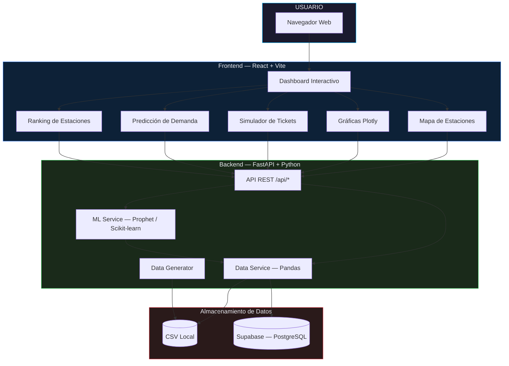
```mermaid
graph TB
    subgraph USUARIO
        U[Navegador Web]
    end

    subgraph FRONTEND["Frontend — React + Vite"]
        UI[Dashboard Interactivo]
        MAP[Mapa de Estaciones]
        GRAF[Gráficas Plotly]
        TICK[Simulador de Tickets]
        PRED[Predicción de Demanda]
        RANK[Ranking de Estaciones]
    end

    subgraph BACKEND["Backend — FastAPI + Python"]
        API[API REST /api/*]
        DS[Data Service — Pandas]
        ML[ML Service — Prophet / Scikit-learn]
        DG[Data Generator]
    end

    subgraph DATOS["Almacenamiento de Datos"]
        CSV[(CSV Local)]
        SUP[(Supabase — PostgreSQL)]
    end

    U --> UI
    UI --> MAP
    UI --> GRAF
    UI --> TICK
    UI --> PRED
    UI --> RANK

    MAP --> API
    GRAF --> API
    TICK --> API
    PRED --> API
    RANK --> API

    API --> DS
    API --> ML
    DS --> CSV
    DS --> SUP
    DG --> CSV

    ML --> DS

    style USUARIO fill:#1a1a2e,stroke:#00B4FF,color:#E8EAF0
    style FRONTEND fill:#0d2137,stroke:#3B82F6,color:#E8EAF0
    style BACKEND fill:#1a2a1a,stroke:#2DC653,color:#E8EAF0
    style DATOS fill:#2a1a1a,stroke:#E63946,color:#E8EAF0
```

### Flujo de Registro de Tickets

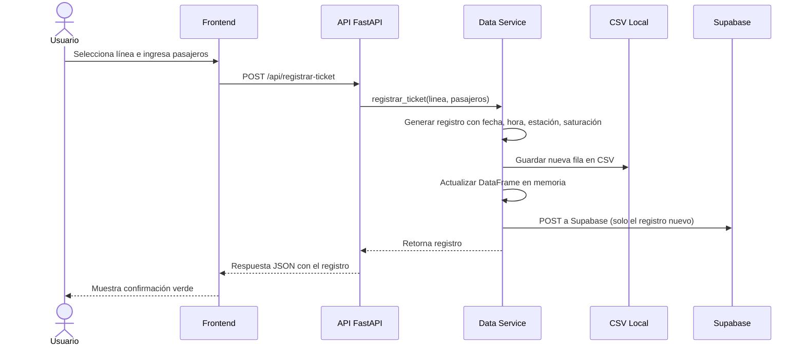
```mermaid
sequenceDiagram
    actor U as Usuario
    participant F as Frontend
    participant A as API FastAPI
    participant D as Data Service
    participant C as CSV Local
    participant S as Supabase

    U->>F: Selecciona línea e ingresa pasajeros
    F->>A: POST /api/registrar-ticket
    A->>D: registrar_ticket(linea, pasajeros)
    D->>D: Generar registro con fecha, hora, estación, saturación
    D->>C: Guardar nueva fila en CSV
    D->>D: Actualizar DataFrame en memoria
    D->>S: POST a Supabase (solo el registro nuevo)
    D-->>A: Retorna registro
    A-->>F: Respuesta JSON con el registro
    F-->>U: Muestra confirmación verde
```

### Flujo de Predicción

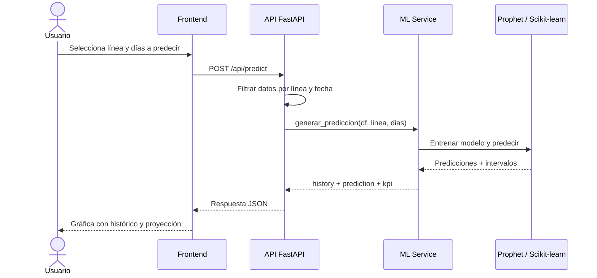
```mermaid
sequenceDiagram
    actor U as Usuario
    participant F as Frontend
    participant A as API FastAPI
    participant ML as ML Service
    participant P as Prophet / Scikit-learn

    U->>F: Selecciona línea y días a predecir
    F->>A: POST /api/predict
    A->>A: Filtrar datos por línea y fecha
    A->>ML: generar_prediccion(df, linea, dias)
    ML->>P: Entrenar modelo y predecir
    P-->>ML: Predicciones + intervalos
    ML-->>A: history + prediction + kpi
    A-->>F: Respuesta JSON
    F-->>U: Gráfica con histórico y proyección
```

### Capas del sistema
#### Frontend (React + Vite)
- Interfaz gráfica del dashboard.
- Consume la API con Axios.
- Visualiza mapas, gráficos, ranking, tickets y predicciones.

#### Backend (FastAPI + Python)
- Expone los endpoints REST.
- Procesa datos con Pandas.
- Genera predicciones con Prophet y regresión lineal.
- Registra tickets nuevos en CSV y en Supabase.

#### Base de datos (Supabase)
- Almacena registros de pasajeros en PostgreSQL.
- Permite consultas SQL y acceso REST.

### Diagrama de Estructura de Carpetas

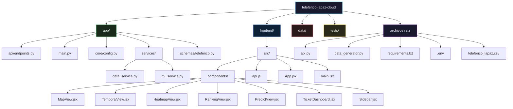
```mermaid
graph TB
    ROOT[teleferico-lapaz-cloud]

    ROOT --> APP[app/]
    ROOT --> FE[frontend/]
    ROOT --> DATA[data/]
    ROOT --> TESTS[tests/]
    ROOT --> FILES[archivos raíz]

    APP --> API[api/endpoints.py]
    APP --> MAIN[main.py]
    APP --> CORE[core/config.py]
    APP --> SERVICES[services/]
    APP --> SCHEMAS[schemas/teleferico.py]

    SERVICES --> DS[data_service.py]
    SERVICES --> ML[ml_service.py]

    FE --> SRC[src/]
    SRC --> COMP[components/]
    SRC --> APIJS[api.js]
    SRC --> APPJSX[App.jsx]
    SRC --> MAINJSX[main.jsx]

    COMP --> MAPVIEW[MapView.jsx]
    COMP --> TEMPVIEW[TemporalView.jsx]
    COMP --> HEATVIEW[HeatmapView.jsx]
    COMP --> RANKVIEW[RankingView.jsx]
    COMP --> PREDVIEW[PredictView.jsx]
    COMP --> TICKVIEW[TicketDashboard.jsx]
    COMP --> SIDEBAR[Sidebar.jsx]

    FILES --> APIPY[api.py]
    FILES --> GEN[data_generator.py]
    FILES --> REQ[requirements.txt]
    FILES --> ENV[.env]
    FILES --> CSV[teleferico_lapaz.csv]

    style ROOT fill:#1a1a2e,stroke:#00B4FF,color:#E8EAF0
    style APP fill:#1a2a1a,stroke:#2DC653,color:#E8EAF0
    style FE fill:#0d2137,stroke:#3B82F6,color:#E8EAF0
    style DATA fill:#2a1a1a,stroke:#E63946,color:#E8EAF0
    style TESTS fill:#2a2a1a,stroke:#FFB703,color:#E8EAF0
    style FILES fill:#1a1a2e,stroke:#7209B7,color:#E8EAF0
```

### Diagrama de Base de Datos (Schema)

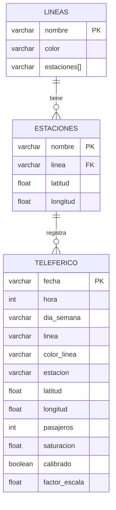
```mermaid
erDiagram
    TELEFERICO {
        varchar fecha PK
        int hora
        varchar dia_semana
        varchar linea
        varchar color_linea
        varchar estacion
        float latitud
        float longitud
        int pasajeros
        float saturacion
        boolean calibrado
        float factor_escala
    }

    LINEAS {
        varchar nombre PK
        varchar color
        varchar estaciones[]
    }

    ESTACIONES {
        varchar nombre PK
        varchar linea FK
        float latitud
        float longitud
    }

    LINEAS ||--o{ ESTACIONES : "tiene"
    ESTACIONES ||--o{ TELEFERICO : "registra"
```

### Diagrama de Componentes del Frontend

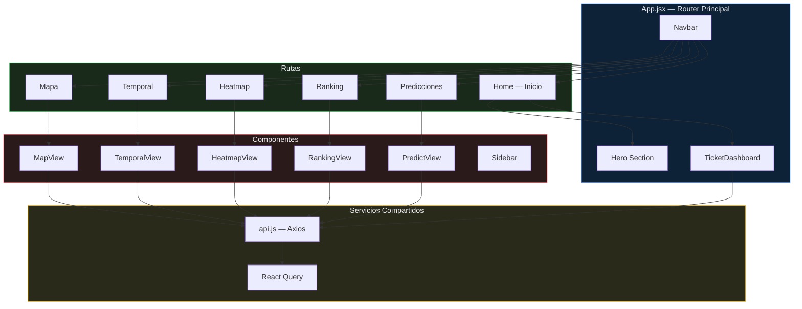
```mermaid
graph TB
    subgraph APP["App.jsx — Router Principal"]
        NAV[Navbar]
        HERO[Hero Section]
        TICKET[TicketDashboard]
    end

    subgraph ROUTES["Rutas"]
        HOME["Home — Inicio"]
        MAP["Mapa"]
        TEMP["Temporal"]
        HEAT["Heatmap"]
        RANK["Ranking"]
        PRED["Predicciones"]
    end

    subgraph COMPONENTS["Componentes"]
        MAPC[MapView]
        TEMPC[TemporalView]
        HEATC[HeatmapView]
        RANKC[RankingView]
        PREDC[PredictView]
        SIDEBAR[Sidebar]
    end

    subgraph SHARED["Servicios Compartidos"]
        API[api.js — Axios]
        RQ[React Query]
    end

    NAV --> HOME
    NAV --> MAP
    NAV --> TEMP
    NAV --> HEAT
    NAV --> RANK
    NAV --> PRED

    HOME --> HERO
    HOME --> TICKET
    MAP --> MAPC
    TEMP --> TEMPC
    HEAT --> HEATC
    RANK --> RANKC
    PRED --> PREDC

    MAPC --> API
    TEMPC --> API
    HEATC --> API
    RANKC --> API
    PREDC --> API
    TICKET --> API

    API --> RQ

    style APP fill:#0d2137,stroke:#3B82F6,color:#E8EAF0
    style ROUTES fill:#1a2a1a,stroke:#2DC653,color:#E8EAF0
    style COMPONENTS fill:#2a1a1a,stroke:#E63946,color:#E8EAF0
    style SHARED fill:#2a2a1a,stroke:#FFB703,color:#E8EAF0
```

### Diagrama de Endpoints de la API

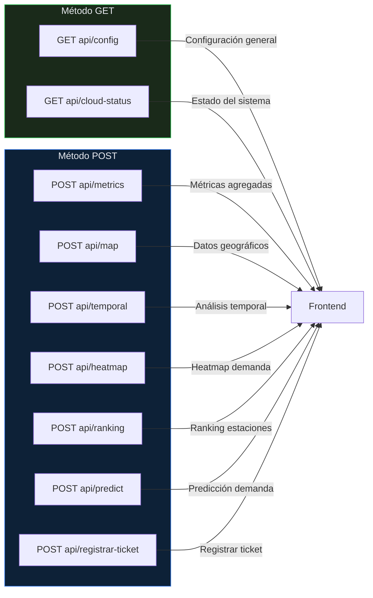
```mermaid
graph LR
    subgraph GET["Método GET"]
        CONFIG["GET api/config"]
        CLOUD["GET api/cloud-status"]
    end

    subgraph POST["Método POST"]
        METRICS["POST api/metrics"]
        MAPAPI["POST api/map"]
        TEMPAPI["POST api/temporal"]
        HEATAPI["POST api/heatmap"]
        RANKAPI["POST api/ranking"]
        PREDAPI["POST api/predict"]
        TICKAPI["POST api/registrar-ticket"]
    end

    CONFIG --> |"Configuración general"| FE[Frontend]
    CLOUD --> |"Estado del sistema"| FE
    METRICS --> |"Métricas agregadas"| FE
    MAPAPI --> |"Datos geográficos"| FE
    TEMPAPI --> |"Análisis temporal"| FE
    HEATAPI --> |"Heatmap demanda"| FE
    RANKAPI --> |"Ranking estaciones"| FE
    PREDAPI --> |"Predicción demanda"| FE
    TICKAPI --> |"Registrar ticket"| FE

    style GET fill:#1a2a1a,stroke:#2DC653,color:#E8EAF0
    style POST fill:#0d2137,stroke:#3B82F6,color:#E8EAF0
```

### Diagrama de Flujo de Datos del Heatmap

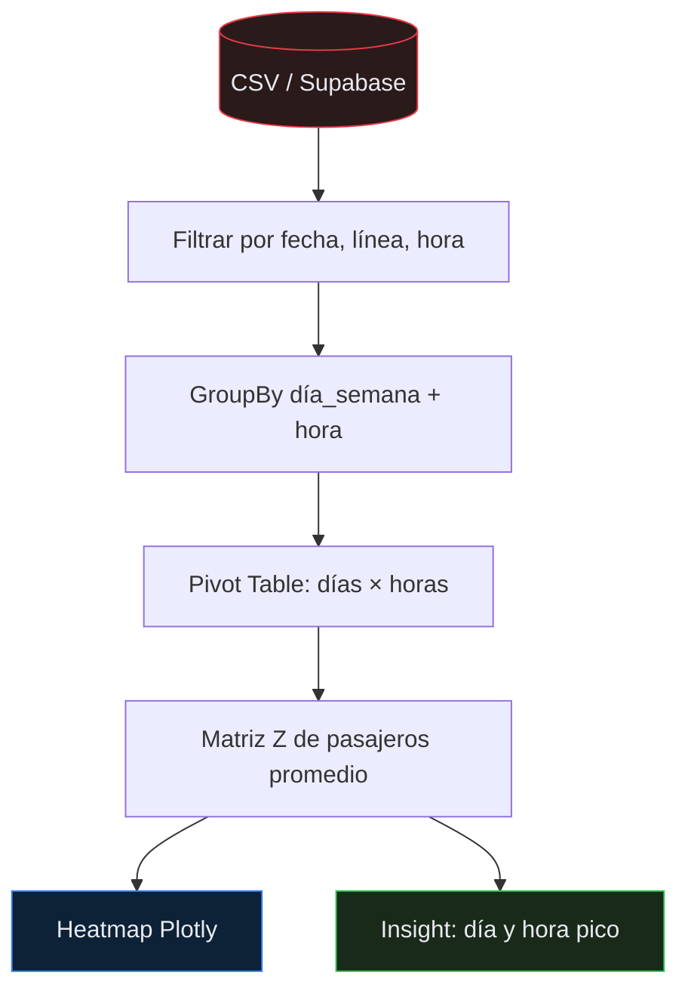
```mermaid
graph TB
    CSV[(CSV / Supabase)] --> FILTER[Filtrar por fecha, línea, hora]
    FILTER --> GROUP[GroupBy día_semana + hora]
    GROUP --> PIVOT[Pivot Table: días × horas]
    PIVOT --> Z[Matriz Z de pasajeros promedio]
    Z --> HEATMAP[Heatmap Plotly]
    Z --> INSIGHT[Insight: día y hora pico]

    style CSV fill:#2a1a1a,stroke:#E63946,color:#E8EAF0
    style HEATMAP fill:#0d2137,stroke:#3B82F6,color:#E8EAF0
    style INSIGHT fill:#1a2a1a,stroke:#2DC653,color:#E8EAF0
```

### Diagrama de Flujo del Ranking

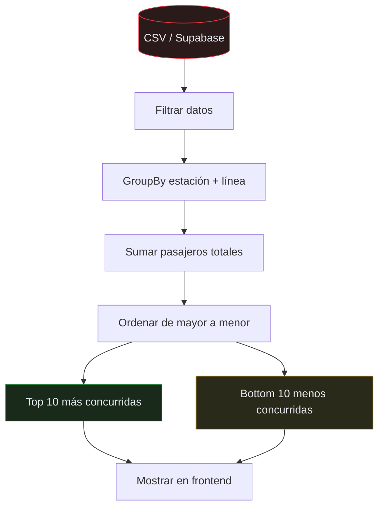
```mermaid
graph TB
    CSV[(CSV / Supabase)] --> FILTER[Filtrar datos]
    FILTER --> GROUP[GroupBy estación + línea]
    GROUP --> SUM[Sumar pasajeros totales]
    SUM --> SORT[Ordenar de mayor a menor]
    SORT --> TOP[Top 10 más concurridas]
    SORT --> BOTTOM[Bottom 10 menos concurridas]
    TOP --> UI[Mostrar en frontend]
    BOTTOM --> UI

    style CSV fill:#2a1a1a,stroke:#E63946,color:#E8EAF0
    style TOP fill:#1a2a1a,stroke:#2DC653,color:#E8EAF0
    style BOTTOM fill:#2a2a1a,stroke:#FFB703,color:#E8EAF0
```

### Diagrama de Predicción con Prophet

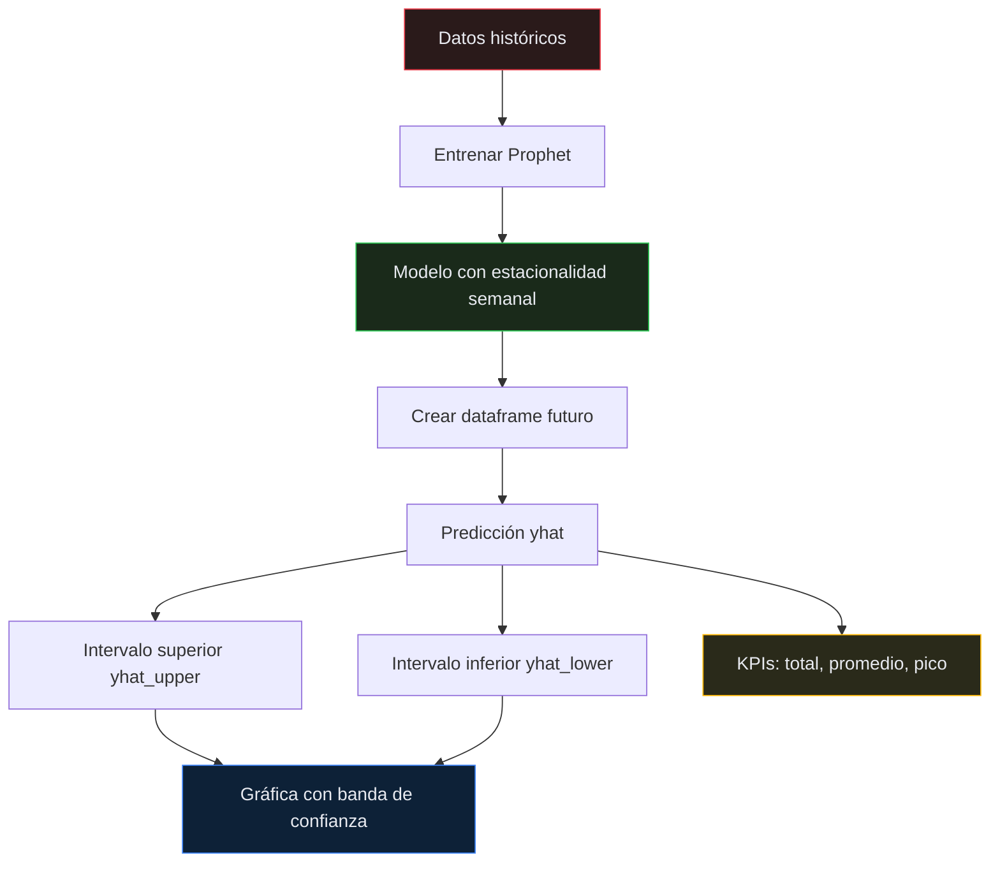
```mermaid
graph TB
    DATA[Datos históricos] --> TRAIN[Entrenar Prophet]
    TRAIN --> MODEL[Modelo con estacionalidad semanal]
    MODEL --> FUTURE[Crear dataframe futuro]
    FUTURE --> PRED[Predicción yhat]
    PRED --> UPPER[Intervalo superior yhat_upper]
    PRED --> LOWER[Intervalo inferior yhat_lower]
    UPPER --> GRAPH[Gráfica con banda de confianza]
    LOWER --> GRAPH
    PRED --> KPI[KPIs: total, promedio, pico]

    style DATA fill:#2a1a1a,stroke:#E63946,color:#E8EAF0
    style MODEL fill:#1a2a1a,stroke:#2DC653,color:#E8EAF0
    style GRAPH fill:#0d2137,stroke:#3B82F6,color:#E8EAF0
    style KPI fill:#2a2a1a,stroke:#FFB703,color:#E8EAF0
```

### Diagrama de Despliegue

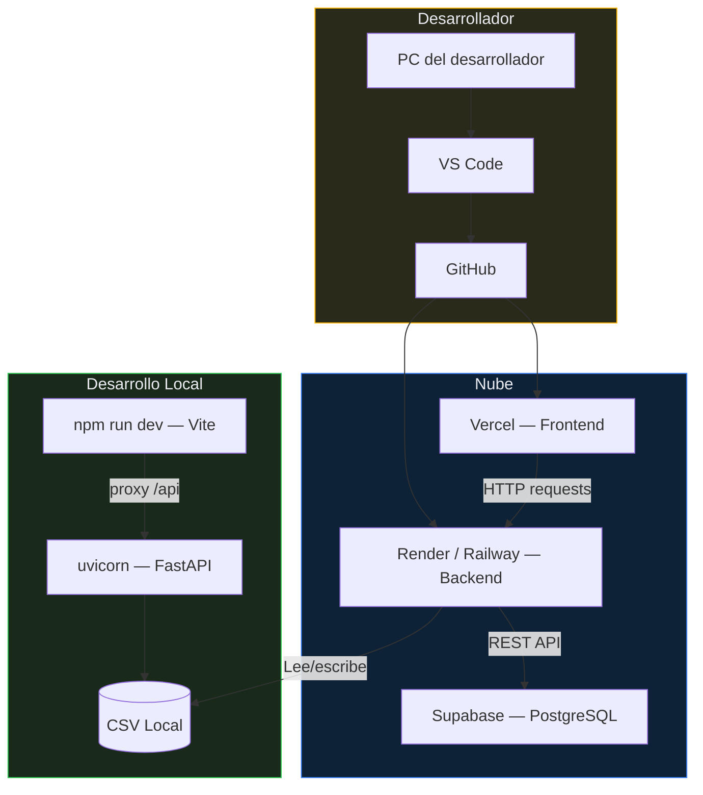
```mermaid
graph TB
    subgraph CLOUD["Nube"]
        VERCEL[Vercel — Frontend]
        RENDER[Render / Railway — Backend]
        SUPABASE[Supabase — PostgreSQL]
    end

    subgraph LOCAL["Desarrollo Local"]
        VITE[npm run dev — Vite]
        UVICORN[uvicorn — FastAPI]
        CSVLOCAL[(CSV Local)]
    end

    subgraph DEV["Desarrollador"]
        PC[PC del desarrollador]
        VSCODE[VS Code]
        GITHUB[GitHub]
    end

    PC --> VSCODE
    VSCODE --> GITHUB
    GITHUB --> VERCEL
    GITHUB --> RENDER

    VERCEL --> |"HTTP requests"| RENDER
    RENDER --> |"REST API"| SUPABASE
    RENDER --> |"Lee/escribe"| CSVLOCAL

    UVICORN --> CSVLOCAL
    VITE --> |"proxy /api"| UVICORN

    style CLOUD fill:#0d2137,stroke:#3B82F6,color:#E8EAF0
    style LOCAL fill:#1a2a1a,stroke:#2DC653,color:#E8EAF0
    style DEV fill:#2a2a1a,stroke:#FFB703,color:#E8EAF0
```

### Diagrama de Pipeline de Datos

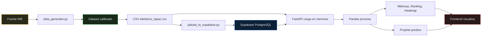
```mermaid
graph LR
    A[Fuente INE] --> B[data_generator.py]
    B --> C[Dataset calibrado]
    C --> D[CSV teleferico_lapaz.csv]
    D --> E[upload_to_supabase.py]
    E --> F[Supabase PostgreSQL]
    D --> G[FastAPI carga en memoria]
    F --> G
    G --> H[Pandas procesa]
    H --> I[Métricas, Ranking, Heatmap]
    H --> J[Prophet predice]
    I --> K[Frontend visualiza]
    J --> K

    style A fill:#2a2a1a,stroke:#FFB703,color:#E8EAF0
    style C fill:#1a2a1a,stroke:#2DC653,color:#E8EAF0
    style F fill:#0d2137,stroke:#3B82F6,color:#E8EAF0
    style K fill:#2a1a1a,stroke:#E63946,color:#E8EAF0
```

### Diagrama de Interacción del Usuario

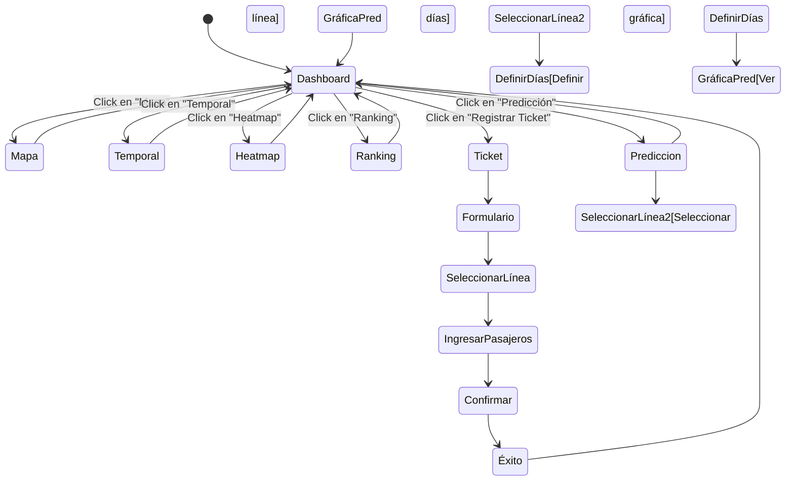
```mermaid
stateDiagram-v2
    [*] --> Dashboard
    Dashboard --> Mapa: Click en "Mapa"
    Dashboard --> Temporal: Click en "Temporal"
    Dashboard --> Heatmap: Click en "Heatmap"
    Dashboard --> Ranking: Click en "Ranking"
    Dashboard --> Prediccion: Click en "Predicción"
    Dashboard --> Ticket: Click en "Registrar Ticket"

    Mapa --> Dashboard
    Temporal --> Dashboard
    Heatmap --> Dashboard
    Ranking --> Dashboard
    Prediccion --> Dashboard

    Ticket --> Formulario
    Formulario --> SeleccionarLínea
    SeleccionarLínea --> IngresarPasajeros
    IngresarPasajeros --> Confirmar
    Confirmar --> Éxito
    Éxito --> Dashboard

    Prediccion --> SeleccionarLínea2[Seleccionar línea]
    SeleccionarLínea2 --> DefinirDías[Definir días]
    DefinirDías --> GráficaPred[Ver gráfica]
    GráficaPred --> Dashboard
```

### Diagrama de Comparación: Datos Reales vs Simulados

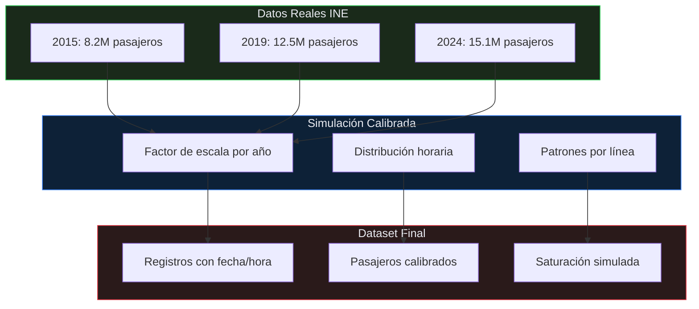
```mermaid
graph TB
    subgraph REAL["Datos Reales INE"]
        R1[2015: 8.2M pasajeros]
        R2[2019: 12.5M pasajeros]
        R3[2024: 15.1M pasajeros]
    end

    subgraph SIM["Simulación Calibrada"]
        S1[Factor de escala por año]
        S2[Distribución horaria]
        S3[Patrones por línea]
    end

    subgraph RESULT["Dataset Final"]
        D1[Registros con fecha/hora]
        D2[Pasajeros calibrados]
        D3[Saturación simulada]
    end

    R1 --> S1
    R2 --> S1
    R3 --> S1
    S1 --> D1
    S2 --> D2
    S3 --> D3

    style REAL fill:#1a2a1a,stroke:#2DC653,color:#E8EAF0
    style SIM fill:#0d2137,stroke:#3B82F6,color:#E8EAF0
    style RESULT fill:#2a1a1a,stroke:#E63946,color:#E8EAF0
```

### Diagrama de Seguridad y Variables de Entorno

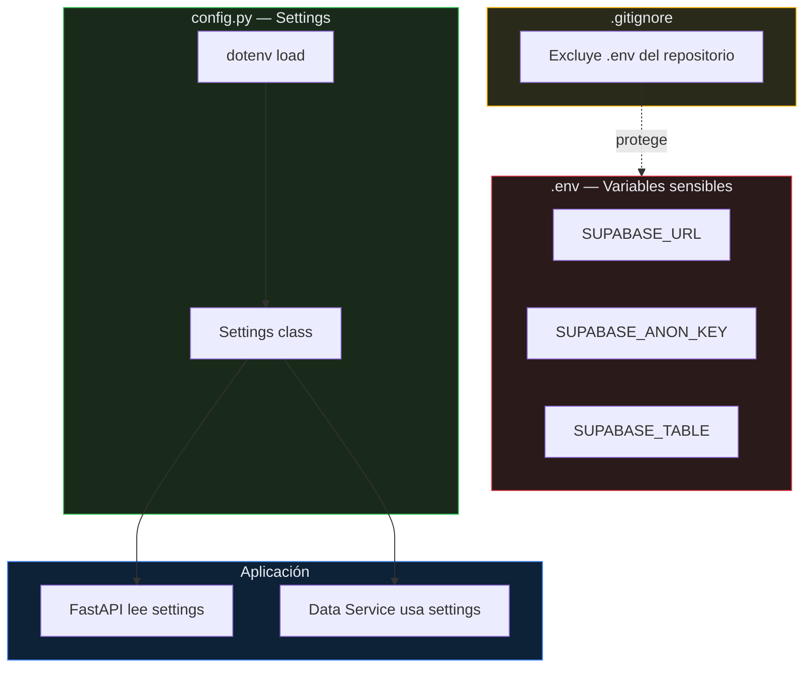
```mermaid
graph TB
    subgraph ENV[".env — Variables sensibles"]
        URL[SUPABASE_URL]
        KEY[SUPABASE_ANON_KEY]
        TABLE[SUPABASE_TABLE]
    end

    subgraph GITIGNORE[".gitignore"]
        GI[Excluye .env del repositorio]
    end

    subgraph CONFIG["config.py — Settings"]
        CS[Settings class]
        LOAD[dotenv load]
    end

    subgraph APP["Aplicación"]
        API2[FastAPI lee settings]
        DS2[Data Service usa settings]
    end

    LOAD --> CS
    CS --> API2
    CS --> DS2
    GI -.-> |"protege"| ENV

    style ENV fill:#2a1a1a,stroke:#E63946,color:#E8EAF0
    style GITIGNORE fill:#2a2a1a,stroke:#FFB703,color:#E8EAF0
    style CONFIG fill:#1a2a1a,stroke:#2DC653,color:#E8EAF0
    style APP fill:#0d2137,stroke:#3B82F6,color:#E8EAF0
```

### Flujo de datos
1. El dataset se genera o carga en el backend.
2. El frontend solicita datos a la API.
3. El backend filtra, agrupa y devuelve métricas.
4. Las predicciones se calculan en el servidor.
5. Los tickets nuevos se guardan localmente y se suben a Supabase.

## IV. Análisis del Proyecto

### Problema que resuelve
- Necesidad de conocer el flujo de pasajeros en el Teleférico de La Paz.
- Falta de información para tomar decisiones sobre horarios, personal y capacidad.

### Solución propuesta
- Dashboard web para visualizar datos en tiempo real.
- Predicción de demanda futura.
- Ranking de estaciones más y menos concurridas.
- Simulador de tickets para probar el sistema con nuevos registros.

### Tipo de datos
- Datos de pasajeros por línea, estación, hora y día.
- Datos geográficos de estaciones.
- Datos de saturación y demanda.

### Modelos utilizados
- Prophet para predicción de series temporales con estacionalidad.
- Regresión lineal como respaldo si Prophet no está disponible.
- Métricas agregadas con Pandas para ranking, promedios y totales.

## V. Diseño del Sistema

### Diseño del backend
- Estructura en módulos: `api.py`, `app/services/`, `app/schemas/`, `app/core/`.
- Endpoints separados por función: métricas, mapa, temporal, heatmap, ranking, predicción y tickets.
- Validación de datos con Pydantic.
- Caché en memoria para mejorar tiempos de respuesta.

### Diseño del frontend
- Componentes por sección: mapa, temporal, heatmap, ranking, predicción, tickets.
- Navegación con React Router.
- Estado global con React Query para Actualización de datos.

### Diseño de datos
- CSV como fuente local principal.
- Supabase como base de datos en la nube.
- Conversión y limpieza de datos en el backend.

## VI. Tipo de Organización del Proyecto

### Organización técnica
- Código separado en carpetas: `app/`, `frontend/`, `data/`, `tests/`.
- Dependencias controladas con `requirements.txt` y `package.json`.
- Variables de entorno en `.env`.

### Organización del trabajo
- Despiegue separado para frontend y backend.
- Uso de GitHub para control de versiones.
- Documentación en README e informe.

## VII. Consulta para ver los datos más recientes en Supabase

### SQL (desde el Editor de Supabase)
```sql
SELECT *
FROM teleferico
ORDER BY fecha DESC, hora DESC
LIMIT 20;
```

### API REST
```http
GET https://<tu-proyecto>.supabase.co/rest/v1/teleferico?order=fecha.desc,hora.desc&limit=20
```

Headers necesarios:
```json
{
  "apikey": "<SUPABASE_ANON_KEY>",
  "Authorization": "Bearer <SUPABASE_ANON_KEY>"
}
```

### Nota
Con la implementación actual, cada ticket registrado desde el simulador se sube automáticamente a Supabase como un solo registro nuevo.

## VIII. Diagramas Adicionales

### Comparación de Líneas del Teleférico

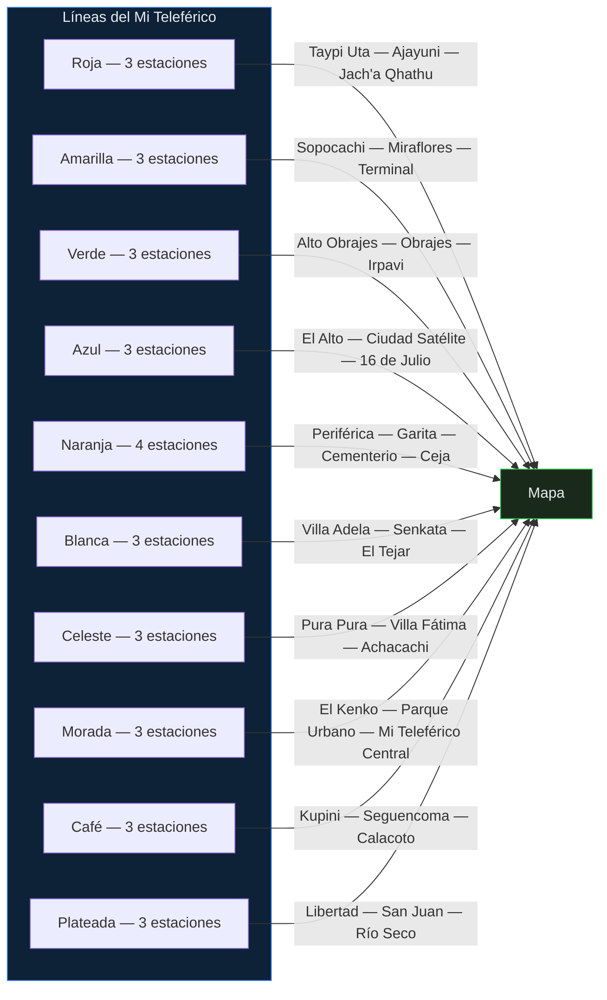
```mermaid
graph LR
    subgraph LINEAS["Líneas del Mi Teleférico"]
        R[Roja — 3 estaciones]
        A[Amarilla — 3 estaciones]
        V[Verde — 3 estaciones]
        AZ[Azul — 3 estaciones]
        N[Naranja — 4 estaciones]
        BL[Blanca — 3 estaciones]
        CE[Celeste — 3 estaciones]
        MO[Morada — 3 estaciones]
        CA[Café — 3 estaciones]
        PL[Plateada — 3 estaciones]
    end

    R --> |"Taypi Uta — Ajayuni — Jach'a Qhathu"| MAP1[Mapa]
    A --> |"Sopocachi — Miraflores — Terminal"| MAP1
    V --> |"Alto Obrajes — Obrajes — Irpavi"| MAP1
    AZ --> |"El Alto — Ciudad Satélite — 16 de Julio"| MAP1
    N --> |"Periférica — Garita — Cementerio — Ceja"| MAP1
    BL --> |"Villa Adela — Senkata — El Tejar"| MAP1
    CE --> |"Pura Pura — Villa Fátima — Achacachi"| MAP1
    MO --> |"El Kenko — Parque Urbano — Mi Teleférico Central"| MAP1
    CA --> |"Kupini — Seguencoma — Calacoto"| MAP1
    PL --> |"Libertad — San Juan — Río Seco"| MAP1

    style LINEAS fill:#0d2137,stroke:#3B82F6,color:#E8EAF0
    style MAP1 fill:#1a2a1a,stroke:#2DC653,color:#E8EAF0
```

### Flujo de Filtrado de Datos

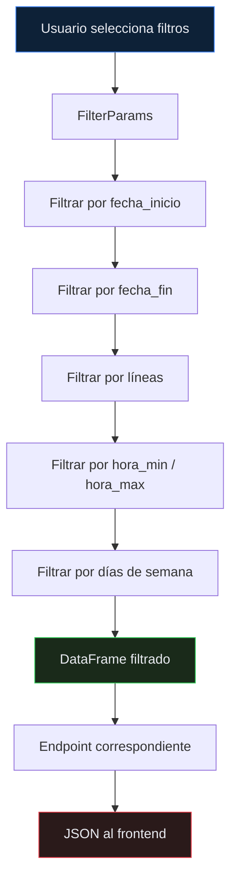
```mermaid
graph TB
    USER[Usuario selecciona filtros] --> FILTER[FilterParams]
    FILTER --> F1[Filtrar por fecha_inicio]
    F1 --> F2[Filtrar por fecha_fin]
    F2 --> F3[Filtrar por líneas]
    F3 --> F4[Filtrar por hora_min / hora_max]
    F4 --> F5[Filtrar por días de semana]
    F5 --> RESULT[DataFrame filtrado]
    RESULT --> API[Endpoint correspondiente]
    API --> RESPONSE[JSON al frontend]

    style USER fill:#0d2137,stroke:#3B82F6,color:#E8EAF0
    style RESULT fill:#1a2a1a,stroke:#2DC653,color:#E8EAF0
    style RESPONSE fill:#2a1a1a,stroke:#E63946,color:#E8EAF0
```

### Prophet vs Regresión Lineal

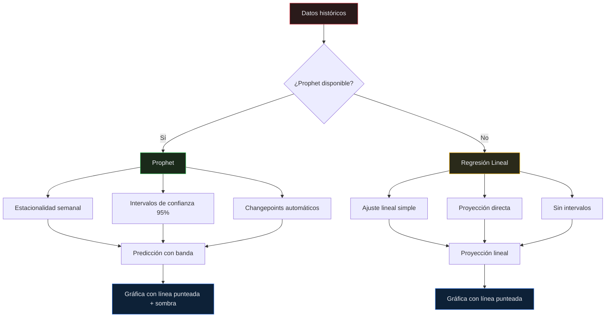
```mermaid
graph TB
    DATA[Datos históricos] --> DEC{¿Prophet disponible?}

    DEC --> |"Sí"| PROPHET[Prophet]
    DEC --> |"No"| LINEAR[Regresión Lineal]

    PROPHET --> P1[Estacionalidad semanal]
    PROPHET --> P2[Intervalos de confianza 95%]
    PROPHET --> P3[Changepoints automáticos]

    LINEAR --> L1[Ajuste lineal simple]
    LINEAR --> L2[Proyección directa]
    LINEAR --> L3[Sin intervalos]

    P1 --> RESULT[Predicción con banda]
    P2 --> RESULT
    P3 --> RESULT

    L1 --> RESULT2[Proyección lineal]
    L2 --> RESULT2
    L3 --> RESULT2

    RESULT --> GRAPH["Gráfica con línea punteada + sombra"]
    RESULT2 --> GRAPH2["Gráfica con línea punteada"]

    style DATA fill:#2a1a1a,stroke:#E63946,color:#E8EAF0
    style PROPHET fill:#1a2a1a,stroke:#2DC653,color:#E8EAF0
    style LINEAR fill:#2a2a1a,stroke:#FFB703,color:#E8EAF0
    style GRAPH fill:#0d2137,stroke:#3B82F6,color:#E8EAF0
    style GRAPH2 fill:#0d2137,stroke:#3B82F6,color:#E8EAF0
```

### Caché en Memoria del Backend

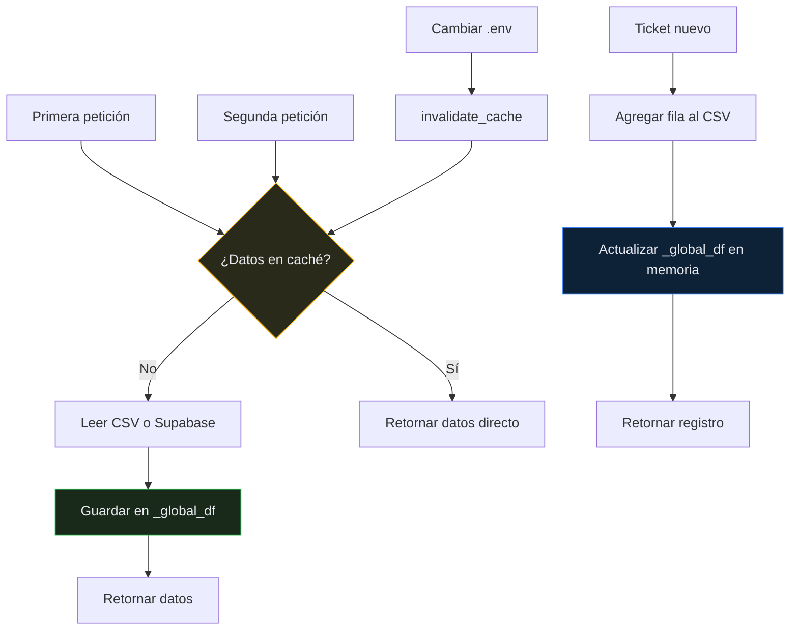
```mermaid
graph TB
    REQ1[Primera petición] --> CACHE{¿Datos en caché?}
    CACHE --> |"No"| LOAD[Leer CSV o Supabase]
    LOAD --> STORE[Guardar en _global_df]
    STORE --> RETURN1[Retornar datos]

    REQ2[Segunda petición] --> CACHE
    CACHE --> |"Sí"| RETURN2[Retornar datos directo]

    REQ3[Ticket nuevo] --> APPEND[Agregar fila al CSV]
    APPEND --> UPDATE[Actualizar _global_df en memoria]
    UPDATE --> RETURN3[Retornar registro]

    REQ4[Cambiar .env] --> INVALIDATE[invalidate_cache]
    INVALIDATE --> CACHE

    style CACHE fill:#2a2a1a,stroke:#FFB703,color:#E8EAF0
    style STORE fill:#1a2a1a,stroke:#2DC653,color:#E8EAF0
    style UPDATE fill:#0d2137,stroke:#3B82F6,color:#E8EAF0
```

### React Query — Gestión de Estado

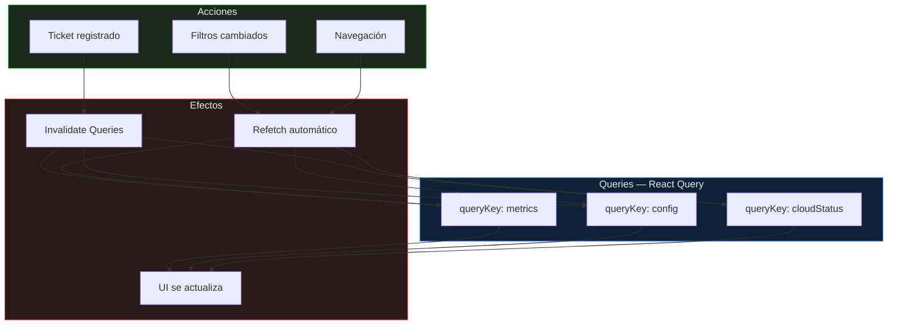
```mermaid
graph TB
    subgraph QUERIES["Queries — React Query"]
        Q1["queryKey: metrics"]
        Q2["queryKey: config"]
        Q3["queryKey: cloudStatus"]
    end

    subgraph ACTIONS["Acciones"]
        TICKET[Ticket registrado]
        FILTER[Filtros cambiados]
        NAV[Navegación]
    end

    subgraph EFFECTS["Efectos"]
        INVALIDATE[Invalidate Queries]
        REFETCH[Refetch automático]
        UI[UI se actualiza]
    end

    TICKET --> INVALIDATE
    FILTER --> REFETCH
    NAV --> REFETCH

    INVALIDATE --> Q1
    INVALIDATE --> Q2
    INVALIDATE --> Q3
    REFETCH --> Q1
    REFETCH --> Q2
    REFETCH --> Q3

    Q1 --> UI
    Q2 --> UI
    Q3 --> UI

    style QUERIES fill:#0d2137,stroke:#3B82F6,color:#E8EAF0
    style ACTIONS fill:#1a2a1a,stroke:#2DC653,color:#E8EAF0
    style EFFECTS fill:#2a1a1a,stroke:#E63946,color:#E8EAF0
```

### Validación del Formulario de Tickets

```mermaid
graph TB
    START[Usuario hace click] --> CHECK1{¿Línea seleccionada?}
    CHECK1 --> |"No"| ERR1[Error: Selecciona una línea]
    CHECK1 --> |"Sí"| CHECK2{¿Pasajeros > 0?}
    CHECK2 --> |"No"| ERR2[Error: Ingresa un número válido]
    CHECK2 --> |"Sí"| LOADING[Estado: loading]
    LOADING --> API[POST /api/registrar-ticket]
    API --> OK{¿Respuesta OK?}
    OK --> |"Sí"| SUCCESS[Estado: ok + mostrar confirmación]
    OK --> |"No"| ERR3[Estado: error + mostrar mensaje]
    SUCCESS --> RESET[Resetear después de 3.5 segundos]

    style START fill:#0d2137,stroke:#3B82F6,color:#E8EAF0
    style SUCCESS fill:#1a2a1a,stroke:#2DC653,color:#E8EAF0
    style ERR1 fill:#2a1a1a,stroke:#E63946,color:#E8EAF0
    style ERR2 fill:#2a1a1a,stroke:#E63946,color:#E8EAF0
    style ERR3 fill:#2a1a1a,stroke:#E63946,color:#E8EAF0
```

### Normalización de Datos

```mermaid
graph LR
    RAW[CSV crudo] --> N1[Normalizar líneas]
    N1 --> N2["Cafe → Café"]
    N2 --> N3[Normalizar días]
    N3 --> N4["Miercoles → Miércoles"]
    N4 --> N5[Convertir tipos]
    N5 --> N6[fecha → datetime]
    N6 --> N7[hora → int]
    N7 --> N8[pasajeros → float]
    N8 --> N9[Drop NaN]
    N9 --> CLEAN[DataFrame limpio]

    style RAW fill:#2a1a1a,stroke:#E63946,color:#E8EAF0
    style CLEAN fill:#1a2a1a,stroke:#2DC653,color:#E8EAF0
```

### Estrategia de Pruebas

```mermaid
graph TB
    subgraph TESTS["Tests — pytest"]
        T1[test_api.py — endpoints]
        T2[Verificar respuestas HTTP]
        T3[Verificar estructura JSON]
    end

    subgraph COMMANDS["Comandos"]
        CMD1["pytest tests/"]
        CMD2["cd frontend && npm run lint"]
        CMD3["cd frontend && npm run build"]
    end

    subgraph CI["Integración Continua"]
        GITHUB[GitHub Actions]
        AUTO[Tests automáticos al hacer push]
    end

    T1 --> CMD1
    T2 --> CMD1
    T3 --> CMD1
    CMD1 --> GITHUB
    CMD2 --> GITHUB
    CMD3 --> GITHUB
    GITHUB --> AUTO

    style TESTS fill:#0d2137,stroke:#3B82F6,color:#E8EAF0
    style COMMANDS fill:#1a2a1a,stroke:#2DC653,color:#E8EAF0
    style CI fill:#2a2a1a,stroke:#FFB703,color:#E8EAF0
```

### Escalabilidad del Sistema

```mermaid
graph TB
    subgraph ACTUAL["Sistema Actual"]
        A1[CSV local]
        A2[FastAPI en un servidor]
        A3[Supabase gratuito]
    end

    subgraph FUTURO["Escalabilidad Futura"]
        F1[Redis para caché]
        F2[Multi-instancia con Docker]
        F3[Supabase plan Pro]
        F4[Autenticación de usuarios]
        F5[WebSockets en tiempo real]
        F6[Modelos ML serializados .pkl]
    end

    ACTUAL --> |"Evolución"| FUTURO

    A1 --> F1
    A2 --> F2
    A3 --> F3
    A2 --> F4
    A2 --> F5
    A2 --> F6

    style ACTUAL fill:#1a2a1a,stroke:#2DC653,color:#E8EAF0
    style FUTURO fill:#0d2137,stroke:#3B82F6,color:#E8EAF0
```

### Cronograma del Proyecto

```mermaid
gantt
    title Cronograma del Proyecto
    dateFormat  YYYY-MM-DD
    section Fase 1
    Generación de datos           :done, d1, 2026-03-01, 15d
    Análisis exploratorio         :done, d2, after d1, 10d
    section Fase 2
    Backend FastAPI               :done, d3, after d2, 20d
    Endpoints REST                :done, d4, after d3, 10d
    section Fase 3
    Frontend React                :done, d5, after d4, 25d
    Integración API               :done, d6, after d5, 10d
    section Fase 4
    Predicción Prophet            :done, d7, after d6, 15d
    Ranking y Heatmap             :done, d8, after d7, 10d
    section Fase 5
    Simulador de Tickets          :done, d9, after d8, 10d
    Integración Supabase          :done, d10, after d9, 10d
    section Fase 6
    Documentación                 :active, d11, after d10, 10d
    Despliegue final              :d12, after d11, 5d
```

### Mapa de Calor — Concepto Visual

```mermaid
graph TB
    subgraph HEATMAP_DATA["Datos de Entrada"]
        H1["Días: Lunes a Domingo"]
        H2["Horas: 06:00 a 22:00"]
    end

    subgraph MATRIX["Matriz de Pasajeros Promedio"]
        M1["Lunes 06:00 = 120"]
        M2["Lunes 12:00 = 850"]
        M3["Viernes 18:00 = 1200"]
        M4["Domingo 10:00 = 400"]
    end

    subgraph OUTPUT["Salida"]
        O1[Heatmap Plotly]
        O2["Insight: Viernes 18:00 = pico"]
    end

    H1 --> MATRIX
    H2 --> MATRIX
    M1 --> O1
    M2 --> O1
    M3 --> O1
    M4 --> O1
    M3 --> O2

    style HEATMAP_DATA fill:#0d2137,stroke:#3B82F6,color:#E8EAF0
    style MATRIX fill:#1a2a1a,stroke:#2DC653,color:#E8EAF0
    style OUTPUT fill:#2a1a1a,stroke:#E63946,color:#E8EAF0
```

### Estructura de un Registro de Ticket

```mermaid
graph TB
    subgraph RECORD["Registro nuevo — Ticket"]
        F["fecha: 2026-06-12"]
        H["hora: 14"]
        D["dia_semana: Jueves"]
        L["linea: Roja"]
        C["color_linea: #E63946"]
        E["estacion: Taypi Uta"]
        LAT["latitud: -16.5000"]
        LON["longitud: -68.1500"]
        P["pasajeros: 5"]
        S["saturacion: 72.5"]
        CAL["calibrado: true"]
        FAC["factor_escala: 1.0"]
    end

    RECORD --> CSV2[CSV local]
    RECORD --> MEM[DataFrame en memoria]
    RECORD --> SUP2[Supabase PostgreSQL]

    style RECORD fill:#0d2137,stroke:#3B82F6,color:#E8EAF0
    style CSV2 fill:#2a1a1a,stroke:#E63946,color:#E8EAF0
    style MEM fill:#1a2a1a,stroke:#2DC653,color:#E8EAF0
    style SUP2 fill:#2a2a1a,stroke:#FFB703,color:#E8EAF0
```

## IX. Diagramas UML

### Caso de Uso — Diagrama UML

```mermaid
graph TB
    subgraph SISTEMA["Sistema Teleférico La Paz Cloud"]
        UC1["Visualizar métricas generales"]
        UC2["Ver mapa de estaciones"]
        UC3["Analizar tendencia temporal"]
        UC4["Explorar heatmap de demanda"]
        UC5["Ver ranking de estaciones"]
        UC6["Predecir demanda futura"]
        UC7["Registrar ticket nuevo"]
        UC8["Filtrar datos por fecha, línea y hora"]
        UC9["Ver estado del sistema"]
        UC10["Consultar datos en Supabase"]
    end

    ADMIN[Administrador] --> UC1
    ADMIN --> UC2
    ADMIN --> UC3
    ADMIN --> UC4
    ADMIN --> UC5
    ADMIN --> UC6
    ADMIN --> UC7
    ADMIN --> UC8
    ADMIN --> UC9
    ADMIN --> UC10

    OPERADOR[Operador] --> UC1
    OPERADOR --> UC2
    OPERADOR --> UC7
    OPERADOR --> UC8

    ANALISTA[Analista de datos] --> UC3
    ANALISTA --> UC4
    ANALISTA --> UC5
    ANALISTA --> UC6

    VISITANTE[Visitante] --> UC1
    VISITANTE --> UC2
    VISITANTE --> UC9

    style SISTEMA fill:#0d2137,stroke:#3B82F6,color:#E8EAF0
    style ADMIN fill:#2a1a1a,stroke:#E63946,color:#E8EAF0
    style OPERADOR fill:#1a2a1a,stroke:#2DC653,color:#E8EAF0
    style ANALISTA fill:#2a2a1a,stroke:#FFB703,color:#E8EAF0
    style VISITANTE fill:#2a2a1a,stroke:#7209B7,color:#E8EAF0
```

### Caso de Uso — Tabla de Especificación

| Caso de Uso | Actor | Descripción | Precondición | Postcondición |
|-------------|-------|-------------|--------------|---------------|
| UC1 | Admin, Operador, Visitante | Visualizar métricas generales del sistema | Hay datos cargados | Se muestran totales, promedios y saturación |
| UC2 | Admin, Operador, Visitante | Ver mapa de estaciones en La Paz | Hay datos geográficos | Mapa con marcadores de líneas y estaciones |
| UC3 | Admin, Analista | Analizar tendencia temporal de pasajeros | Hay datos históricos | Gráficas de evolución diaria y por horas |
| UC4 | Admin, Analista | Explorar heatmap de demanda por día y hora | Hay datos suficientes | Heatmap con intensidad de pasajeros |
| UC5 | Admin, Analista | Ver ranking de estaciones más y menos concurridas | Hay datos de estaciones | Top 10 y Bottom 10 ordenados |
| UC6 | Admin, Analista | Predecir demanda futura con Prophet | Hay ≥10 días de historial | Gráfica con proyección y KPIs |
| UC7 | Admin, Operador | Registrar ticket nuevo desde el simulador | Línea seleccionada y pasajeros > 0 | Registro guardado en CSV y Supabase |
| UC8 | Admin, Operador | Filtrar datos por fecha, línea y hora | Hay datos disponibles | Datos filtrados actualizados |
| UC9 | Admin, Visitante | Ver estado del sistema (Supabase/CSV) | Configuración de entorno | Estado y fuente de datos mostrada |
| UC10 | Admin | Consultar datos recientes en Supabase | Supabase configurado | Datos visibles en dashboard Supabase |

### Diagrama de Componentes UML

```mermaid
graph TB
    subgraph FRONTEND_PKG["Paquete: Frontend"]
        UI[UI Dashboard]
        ROUTER[React Router]
        QUERY[React Query]
        APIJS[Axios API Client]
    end

    subgraph BACKEND_PKG["Paquete: Backend"]
        API_FAST[FastAPI Router]
        ENDPOINTS[Endpoints]
        SCHEMAS[Pydantic Schemas]
    end

    subgraph SERVICES_PKG["Paquete: Services"]
        DATA_SVC[Data Service]
        ML_SVC[ML Service]
        DATA_GEN[Data Generator]
    end

    subgraph DATA_PKG["Paquete: Datos"]
        CSV_DS[CSV Dataset]
        SUPABASE_DB[(Supabase PostgreSQL)]
    end

    UI --> ROUTER
    UI --> QUERY
    QUERY --> APIJS
    APIJS --> |"HTTP REST"| API_FAST

    API_FAST --> ENDPOINTS
    ENDPOINTS --> SCHEMAS
    ENDPOINTS --> DATA_SVC
    ENDPOINTS --> ML_SVC

    DATA_SVC --> CSV_DS
    DATA_SVC --> SUPABASE_DB
    ML_SVC --> DATA_SVC
    DATA_GEN --> CSV_DS

    style FRONTEND_PKG fill:#0d2137,stroke:#3B82F6,color:#E8EAF0
    style BACKEND_PKG fill:#1a2a1a,stroke:#2DC653,color:#E8EAF0
    style SERVICES_PKG fill:#2a2a1a,stroke:#FFB703,color:#E8EAF0
    style DATA_PKG fill:#2a1a1a,stroke:#E63946,color:#E8EAF0
```

### Diagrama de Actividad — Registro de Ticket

```mermaid
graph TB
    START((Inicio)) --> A[Seleccionar línea del teleférico]
    A --> B[Ingresar cantidad de pasajeros]
    B --> C{¿Línea seleccionada?}
    C --> |"No"| D[Mostrar error:Selecciona una línea]
    D --> A
    C --> |"Sí"| E{¿Pasajeros > 0?}
    E --> |"No"| F[Mostrar error:Número inválido]
    F --> B
    E --> |"Sí"| G[Mostrar estado: loading]
    G --> H[Enviar POST a /api/registrar-ticket]
    H --> I{¿Respuesta exitosa?}
    I --> |"No"| J[Mostrar error del servidor]
    I --> |"Sí"| K[Guardar registro en estado]
    K --> L[Agregar al historial de sesión]
    L --> M[Invalidar queries de React Query]
    M --> N[Mostrar confirmación verde]
    N --> O[Esperar 3.5 segundos]
    O --> P[Limpiar estado de feedback]
    P --> Q[Resetear formulario]
    Q --> END((Fin))

    style START fill:#1a2a1a,stroke:#2DC653,color:#E8EAF0
    style END fill:#1a2a1a,stroke:#2DC653,color:#E8EAF0
    style D fill:#2a1a1a,stroke:#E63946,color:#E8EAF0
    style F fill:#2a1a1a,stroke:#E63946,color:#E8EAF0
    style J fill:#2a1a1a,stroke:#E63946,color:#E8EAF0
    style N fill:#1a2a1a,stroke:#2DC653,color:#E8EAF0
```

### Diagrama de Actividad — Predicción de Demanda

```mermaid
graph TB
    START2((Inicio)) --> A2[Seleccionar línea a predecir]
    A2 --> B2[Definir número de días]
    B2 --> C2[Enviar POST a /api/predict]
    C2 --> D2[Filtrar datos por línea y fecha]
    D2 --> E2[Agrupar pasajeros por fecha]
    E2 --> F2{¿≥10 días de historial?}
    F2 --> |"No"| G2[Retornar error: datos insuficientes]
    F2 --> |"Sí"| H2{¿Prophet disponible?}
    H2 --> |"Sí"| I2[Entrenar modelo Prophet]
    I2 --> J2[Generar predicción con intervalos]
    H2 --> |"No"| K2[Entrenar Regresión Lineal]
    K2 --> L2[Generar proyección lineal]
    J2 --> M2[Calcular KPIs: total, promedio, pico]
    L2 --> M2
    M2 --> N2[Retornar history + prediction + kpi]
    N2 --> O2[Frontend renderiza gráfica Plotly]
    O2 --> P2[Mostrar KPIs debajo de la gráfica]
    P2 --> END2((Fin))

    style START2 fill:#1a2a1a,stroke:#2DC653,color:#E8EAF0
    style END2 fill:#1a2a1a,stroke:#2DC653,color:#E8EAF0
    style G2 fill:#2a1a1a,stroke:#E63946,color:#E8EAF0
    style I2 fill:#1a2a1a,stroke:#2DC653,color:#E8EAF0
    style K2 fill:#2a2a1a,stroke:#FFB703,color:#E8EAF0
```

### Diagrama de Clases

```mermaid
classDiagram
    class FilterParams {
        +str fecha_inicio
        +str fecha_fin
        +List~str~ lineas
        +int hora_min
        +int hora_max
        +List~str~ dias_semana
    }

    class PredictParams {
        +FilterParams filters
        +str linea
        +int dias_pred
    }

    class TicketPayload {
        +str linea
        +int pasajeros
    }

    class DataService {
        +get_data() DataFrame
        +filter_data(params) DataFrame
        +registrar_ticket(linea, pasajeros) dict
        +get_data_source() str
        +invalidate_cache() void
    }

    class MLService {
        +generar_prediccion(df, linea, dias_pred) dict
    }

    class Settings {
        +str SUPABASE_URL
        +str SUPABASE_ANON_KEY
        +str SUPABASE_TABLE
    }

    class TicketDashboard {
        +str lineaSeleccionada
        +int pasajeros
        +str estado
        +list historial
        +handleSubmit() void
    }

    class PredictView {
        +data: object
        +str linea
        +int diasPred
        +renderPlot() Plotly
    }

    class RankingView {
        +data: object
        +renderList() JSX
    }

    FilterParams <|-- PredictParams
    DataService --> Settings : usa
    DataService --> FilterParams : filtra
    MLService --> DataService : consulta datos
    TicketDashboard --> TicketPayload : envía
    PredictView --> PredictParams : envía
    RankingView --> FilterParams : envía
```

### Diagrama de Secuencia — Filtro de Datos

```mermaid
sequenceDiagram
    actor U as Usuario
    participant F as Frontend
    participant A as API
    participant DS as Data Service
    participant CSV as CSV / Supabase

    U->>F: Cambia filtros (fecha, línea, hora)
    F->>A: POST /api/metrics con FilterParams
    A->>DS: filter_data(params)
    DS->>CSV: get_data() — carga DataFrame
    CSV-->>DS: DataFrame completo
    DS->>DS: Aplicar máscara de filtros
    DS-->>A: DataFrame filtrado
    A->>A: Calcular métricas (totales, promedios)
    A-->>F: JSON con métricas
    F-->>U: Dashboard se actualiza
```

### Diagrama de Secuencia — Ranking de Estaciones

```mermaid
sequenceDiagram
    actor U as Usuario
    participant F as Frontend
    participant A as API
    participant DS as Data Service
    participant PD as Pandas

    U->>F: Navega a /ranking
    F->>A: POST /api/ranking con FilterParams
    A->>DS: filter_data(params)
    DS-->>A: DataFrame filtrado
    A->>PD: groupby estación + línea
    PD-->>A: Totales por estación
    A->>A: Ordenar descendente
    A->>A: Separar Top 10 y Bottom 10
    A-->>F: JSON con top, bottom, max_total
    F-->>U: Mostrar listas con barras de progreso
```

### Diagrama de Secuencia — Heatmap

```mermaid
sequenceDiagram
    actor U as Usuario
    participant F as Frontend
    participant A as API
    participant DS as Data Service
    participant NP as NumPy

    U->>F: Navega a /heatmap
    F->>A: POST /api/heatmap con FilterParams
    A->>DS: filter_data(params)
    DS-->>A: DataFrame filtrado
    A->>A: Pivot table día_semana × hora
    A->>NP: Calcular array Z
    NP-->>A: Matriz de pasajeros promedio
    A->>NP: argmax → día y hora pico
    NP-->>A: Insight
    A-->>F: JSON con x, y, z, insight
    F-->>U: Renderizar heatmap Plotly
```

### Diagrama de Paquetes UML

```mermaid
graph TB
    subgraph PRESENTATION["Presentación"]
        REACT[React + Vite]
        ROUTER2[React Router]
        RQ2[React Query]
        PLOTLY[Plotly.js]
        LEAFLET[Leaflet]
    end

    subgraph BUSINESS["Lógica de Negocio"]
        API3[FastAPI]
        END2[Endpoints]
        PYDANTIC[Pydantic Schemas]
    end

    subgraph DOMAIN["Dominio"]
        DS2[Data Service]
        ML2[ML Service]
        GEN2[Data Generator]
    end

    subgraph INFRASTRUCTURE["Infraestructura"]
        CSV3[CSV File]
        SUP2[(Supabase)]
        dotenv[.env Variables]
    end

    PRESENTATION -->|"HTTP REST"| BUSINESS
    BUSINESS --> DOMAIN
    DOMAIN --> INFRASTRUCTURE

    style PRESENTATION fill:#0d2137,stroke:#3B82F6,color:#E8EAF0
    style BUSINESS fill:#1a2a1a,stroke:#2DC653,color:#E8EAF0
    style DOMAIN fill:#2a2a1a,stroke:#FFB703,color:#E8EAF0
    style INFRASTRUCTURE fill:#2a1a1a,stroke:#E63946,color:#E8EAF0
```

## X. Diagramas de Soporte y Justificación en la Nube

### Comparativa de Costos — Planes Gratuitos vs Pagos

```mermaid
graph TB
    subgraph VERCEL["Vercel — Frontend"]
        VF1["Free Tier"]
        VF2["Pro: $20/mes por usuario"]

        VF1A["100 GB de transferencia"]
        VF1B["Despliegue ilimitado"]
        VF1C["Soporte comunitario"]

        VF2A["Transferencia ilimitada"]
        VF2B["Soporte prioritario"]
        VF2C["Analíticas avanzadas"]

        VF1 --> VF1A
        VF1 --> VF1B
        VF1 --> VF1C
        VF2 --> VF2A
        VF2 --> VF2B
        VF2 --> VF2C
    end

    subgraph RENDER["Render — Backend"]
        RF1["Free Tier"]
        RF2["Starter: $7/mes"]
        RF3["Standard: $25/mes"]

        RF1A["Servidor se duerme after 15 min"]
        RF1B["512 MB RAM"]
        RF1C["Compartido"]

        RF2A["512 MB RAM dedicado"]
        RF2B["Sin sleep"]
        RF2C["DNS personalizado"]

        RF3A["1 GB RAM"]
        RF3B["Escalabilidad automática"]
        RF3C["Soporte email"]

        RF1 --> RF1A
        RF1 --> RF1B
        RF1 --> RF1C
        RF2 --> RF2A
        RF2 --> RF2B
        RF2 --> RF2C
        RF3 --> RF3A
        RF3 --> RF3B
        RF3 --> RF3C
    end

    subgraph RAILWAY["Railway — Alternativa Backend"]
        RFREE["Free: $5 de crédito mensual"]
        RPRO["Pro: $5/mes + uso"]

        RFREEA["512 MB RAM / 1 GB disco"]
        RFREEB["Se agota el crédito = se apaga"]
        RPROA["RAM y CPU ilimitados"]
        RPROB["Escalabilidad horizontal"]

        RFREE --> RFREEA
        RFREE --> RFREEB
        RPRO --> RPROA
        RPRO --> RPROB
    end

    subgraph SUPABASE["Supabase — Base de Datos"]
        SF1["Free Tier"]
        SF2["Pro: $25/mes"]
        SF3["Team: $599/mes"]

        SF1A["500 MB de base de datos"]
        SF1B["1 GB de almacenamiento"]
        SF1C["50,000 usuarios activos/mes"]
        SF1D["APIs REST y GraphQL"]

        SF2A["8 GB de base de datos"]
        SF2B["100 GB de almacenamiento"]
        SF2C["Soporte prioritario"]
        SF2D["Auth + Storage"]

        SF3A["Dedicado"]
        SF3B["SLA 99.9%"]
        SF3C["Soporte 24/7"]

        SF1 --> SF1A
        SF1 --> SF1B
        SF1 --> SF1C
        SF1 --> SF1D
        SF2 --> SF2A
        SF2 --> SF2B
        SF2 --> SF2C
        SF2 --> SF2D
        SF3 --> SF3A
        SF3 --> SF3B
        SF3 --> SF3C
    end

    subgraph TOTAL["Costo Total Estimado"]
        TFREE["Plan Gratuito: $0/mes"]
        TPAID["Plan Pago: ~$52-82/mes"]

        TFREEA["Funcional para demo"]
        TFREEB["Limitaciones: sleep, storage"]
        TPAIDA["Producción completa"]
        TPAIDB["Escalable y confiable"]

        TFREE --> TFREEA
        TFREE --> TFREEB
        TPAID --> TPAIDB
        TPAID --> TPAIDB
    end

    style VERCEL fill:#0d2137,stroke:#3B82F6,color:#E8EAF0
    style RENDER fill:#1a2a1a,stroke:#2DC653,color:#E8EAF0
    style RAILWAY fill:#2a2a1a,stroke:#FFB703,color:#E8EAF0
    style SUPABASE fill:#2a1a1a,stroke:#E63946,color:#E8EAF0
    style TOTAL fill:#1a1a2e,stroke:#7209B7,color:#E8EAF0
```

### Tabla Comparativa de Planes

| Servicio | Plan Gratuito | Plan Pago Recomendado | Costo |
|----------|--------------|----------------------|-------|
| **Vercel** (Frontend) | 100 GB transferencia, despliegue ilimitado | Pro | $20/mes |
| **Render** (Backend) | 512 MB RAM, sleep after 15 min | Starter | $7/mes |
| **Railway** (alternativa) | $5 crédito/mes | Pro | $5/mes + uso |
| **Supabase** (BD) | 500 MB DB, 1 GB storage | Pro | $25/mes |
| **TOTAL** | **$0/mes** | **~$52-57/mes** | |

### Modelo de Responsabilidad Compartida (Shared Responsibility Model)

```mermaid
graph TB
    subgraph PROVEEDOR["Proveedor Cloud (Supabase, Vercel, Render)"]
        P1["Infraestructura física (servidores, red, data center)"]
        P2["Sistema operativo y actualizaciones de seguridad"]
        P3["Replicación y backups de la base de datos"]
        P4["Certificados SSL / HTTPS"]
        P5["Protección contra DDoS"]
        P6["Redundancia geográfica"]
        P7["Cumplimiento GDPR / SOC 2"]
        P8[" Mantenimiento de hardware"]
    end

    subgraph COMPARTIDO["Responsabilidad Compartida"]
        C1["Configuración de CORS"]
        C2["Variables de entorno (.env)"]
        C3["Políticas de autenticación"]
        C4["Reglas de acceso a la base de datos"]
        C5["Gestión de dependencias y versiones"]
        C6["Monitoreo de uso y costos"]
    end

    subgraph EQUIPO["Equipo del Proyecto (Grupo 19)"]
        E1["Código de la aplicación (frontend + backend)"]
        E2["Diseño de la base de datos (schema)"]
        E3["Lógica de negocio y predicciones"]
        E4["Seguridad del código (validación, sanitización)"]
        E5["Gestión de datos y calibración"]
        E6["Tests y documentación"]
        E7["Despliegue y configuración"]
        E8["Gestión de acceso de usuarios"]
    end

    PROVEEDOR --> COMPARTIDO
    EQUIPO --> COMPARTIDO

    style PROVEEDOR fill:#1a2a1a,stroke:#2DC653,color:#E8EAF0
    style COMPARTIDO fill:#2a2a1a,stroke:#FFB703,color:#E8EAF0
    style EQUIPO fill:#2a1a1a,stroke:#E63946,color:#E8EAF0
```

### Tabla de Responsabilidades

| Capa | Proveedor Cloud | Equipo (Grupo 19) |
|------|----------------|-------------------|
| **Infraestructura** | Servidores, storage, red | — |
| **Plataforma** | SO, runtime, actualizaciones | — |
| **Datos** | Backups, replicación | Schema, calibración, integridad |
| **Código** | — | Frontend, backend, lógica ML |
| **Seguridad** | DDoS, SSL, firewall físico | CORS, auth, validación |
| **Red** | DNS, CDN, load balancing | Configuración de dominios |
| **Monitoreo** | Métricas de infra | Logs de aplicación, uso |
| **Costos** | Facturación y límites | Optimización de consultas |

### Comparación de Modelos de Servicio Cloud (IaaS / PaaS / SaaS / DBaaS)

```mermaid
graph TB
    subgraph IaaS["IaaS — Infrastructure as a Service"]
        I1["Proveedor gestiona: hardware, red, storage, virtualización"]
        I2["Usuario gestiona: SO, runtime, middleware, datos, código"]
        I3["Ejemplos: AWS EC2, Google Compute Engine, Azure VM"]
        I4["Nuestro proyecto: NO usa IaaS directamente"]
    end

    subgraph PAAS["PaaS — Platform as a Service"]
        P1["Proveedor gestiona: infra + SO + runtime + deploy"]
        P2["Usuario gestiona: código y datos"]
        P3["Ejemplos: Vercel, Render, Railway, Heroku"]
        P4["Nuestro proyecto: Frontend en Vercel, Backend en Render"]
    end

    subgraph DBAAS["DBaaS — Database as a Service"]
        D1["Proveedor gestiona: infra + motor de BD + backups"]
        D2["Usuario gestiona: schema, consultas, datos"]
        D3["Ejemplos: Supabase, PlanetScale, Firebase"]
        D4["Nuestro proyecto: Supabase (PostgreSQL)"]
    end

    subgraph SAAS["SaaS — Software as a Service"]
        S1["Proveedor gestiona: TODO (app completa)"]
        S2["Usuario gestiona: solo uso y configuración"]
        S3["Ejemplos: Google Sheets, Salesforce, Notion"]
        S4["Nuestro proyecto: NO usa SaaS para componentes core"]
    end

    IaaS --> |"Más control, más trabajo"| PAAS
    PAAS --> |"Balance ideal para nuestro proyecto"| DBAAS
    DBAAS --> |"Menos control, menos trabajo"| SAAS

    style IaaS fill:#2a1a1a,stroke:#E63946,color:#E8EAF0
    style PAAS fill:#1a2a1a,stroke:#2DC653,color:#E8EAF0
    style DBAAS fill:#0d2137,stroke:#3B82F6,color:#E8EAF0
    style SAAS fill:#2a2a1a,stroke:#FFB703,color:#E8EAF0
```

### Ubicación de Componentes del Proyecto por Modelo

```mermaid
graph LR
    subgraph PAAS_USO["PaaS — Nuestro Uso"]
        V1["Vercel → Frontend React"]
        V2["Render → Backend FastAPI"]
        V3["Railway → Alternativa Backend"]
    end

    subgraph DBAAS_USO["DBaaS — Nuestro Uso"]
        S1["Supabase → PostgreSQL"]
        S2["Supabase → REST API"]
        S3["Supabase → Auth (futuro)"]
    end

    subgraph LOCAL["Local / Otros"]
        L1["CSV → Almacenamiento local"]
        L2["GitHub → Control de versiones"]
        L3["VS Code → Desarrollo"]
    end

    PAAS_USO -->|"Despliegue"| CLOUD[Nube]
    DBAAS_USO -->|"Almacenamiento"| CLOUD
    LOCAL -->|"Desarrollo"| DEV[Desarrollador]

    style PAAS_USO fill:#1a2a1a,stroke:#2DC653,color:#E8EAF0
    style DBAAS_USO fill:#0d2137,stroke:#3B82F6,color:#E8EAF0
    style LOCAL fill:#2a2a1a,stroke:#FFB703,color:#E8EAF0
    style CLOUD fill:#1a1a2e,stroke:#7209B7,color:#E8EAF0
    style DEV fill:#2a1a1a,stroke:#E63946,color:#E8EAF0
```

### Justificación de Selección de Proveedor

```mermaid
graph TB
    subgraph CRITERIOS["Criterios de Evaluación"]
        CR1["Costo"]
        CR2["Facilidad de uso"]
        CR3["Escalabilidad"]
        CR4["Comunidad y soporte"]
        CR5["Integración con el stack"]
    end

    subgraph VERCEL_J["Vercel — Elegido para Frontend"]
        VJ1["Despliegue automático desde GitHub"]
        VJ2["Optimización para React/Vite"]
        VJ3["Plan gratuito suficiente"]
        VJ4["CDN global incluido"]
    end

    subgraph RENDER_J["Render — Elegido para Backend"]
        RJ1["Soporte nativo para Python/FastAPI"]
        RJ2["Plan gratuito funcional"]
        RJ3["Despliegue fácil"]
        RJ4["Variables de entorno integradas"]
    end

    subgraph SUPABASE_J["Supabase — Elegido para BD"]
        SJ1["PostgreSQL completo"]
        SJ2["API REST automática"]
        SJ3["Plan gratuito generoso"]
        SJ4["Dashboard visual"]
        SJ5["Auth y Storage incluidos"]
    end

    CRITERIOS --> VERCEL_J
    CRITERIOS --> RENDER_J
    CRITERIOS --> SUPABASE_J

    style CRITERIOS fill:#2a2a1a,stroke:#FFB703,color:#E8EAF0
    style VERCEL_J fill:#0d2137,stroke:#3B82F6,color:#E8EAF0
    style RENDER_J fill:#1a2a1a,stroke:#2DC653,color:#E8EAF0
    style SUPABASE_J fill:#2a1a1a,stroke:#E63946,color:#E8EAF0
```

### Diagrama de Decisión — Qué Servicio Usar

```mermaid
graph TB
    START[¿Qué necesitas?] --> Q1{¿Almacenar datos?}

    Q1 --> |"Sí"| Q2{¿SQL o NoSQL?}
    Q1 --> |"No"| Q3{¿Desplegar código?}

    Q2 --> |"SQL"| Q4{¿API automática?}
    Q2 --> |"NoSQL"| FIREBASE[Firebase / Firestore]

    Q4 --> |"Sí"| SUPA[Supabase — DBaaS]
    Q4 --> |"No"| PLANET[PlanetScale / Neon]

    Q3 --> |"Frontend estático"| VERCEL2[Vercel — PaaS]
    Q3 --> |"Backend API"| Q5{¿Lenguaje?}

    Q5 --> |"Python"| RENDER2[Render — PaaS]
    Q5 --> |"Node.js"| RAILWAY2[Railway — PaaS]
    Q5 --> |"Go / Rust"| FLY[Fly.io]

    style START fill:#1a1a2e,stroke:#7209B7,color:#E8EAF0
    style SUPA fill:#0d2137,stroke:#3B82F6,color:#E8EAF0
    style VERCEL2 fill:#1a2a1a,stroke:#2DC653,color:#E8EAF0
    style RENDER2 fill:#1a2a1a,stroke:#2DC653,color:#E8EAF0
    style RAILWAY2 fill:#2a2a1a,stroke:#FFB703,color:#E8EAF0
    style FIREBASE fill:#2a1a1a,stroke:#E63946,color:#E8EAF0
```

### Evolución del Costo según Escala

```mermaid
graph LR
    subgraph FASE1["Fase 1 — Desarrollo"]
        F1A["Costo: $0/mes"]
        F1B["Servicios: Free tiers"]
        F1C["Limitaciones: aceptables"]
    end

    subgraph FASE2["Fase 2 — Demo/Presentación"]
        F2A["Costo: $0-7/mes"]
        F2B["Servicios: Free + Render Starter"]
        F2C["Suficiente para presentar"]
    end

    subgraph FASE3["Fase 3 — Producción"]
        F3A["Costo: ~$52-82/mes"]
        F3B["Servicios: Planes pagos"]
        F3C["Completo y escalable"]
    end

    subgraph FASE4["Fase 4 — Escala"]
        F4A["Costo: $200+/mes"]
        F4B["Servicios: Planes enterprise"]
        F4C["Miles de usuarios"]
    end

    FASE1 --> FASE2 --> FASE3 --> FASE4

    style FASE1 fill:#1a2a1a,stroke:#2DC653,color:#E8EAF0
    style FASE2 fill:#0d2137,stroke:#3B82F6,color:#E8EAF0
    style FASE3 fill:#2a2a1a,stroke:#FFB703,color:#E8EAF0
    style FASE4 fill:#2a1a1a,stroke:#E63946,color:#E8EAF0
```
