# Informe del Proyecto — Teleférico La Paz Cloud Analytics

## I. Primera Parte

### Carátula
- Nombre del proyecto: Análisis de Datos del Mi Teleférico de La Paz
- Grupo: 19
- Materia: Computación en la Nube
- Universidad: Universidad Mayor de San Andrés (UMSA)
- Año: 2026

### Introducción
El proyecto consiste en un dashboard de análisis de datos del sistema de teleférico de La Paz. Se utiliza un dataset sintético con patrones de demanda reales para demostrar análisis de flujos de pasajeros, picos horarios, saturación y predicciones de demanda.

### Marco teórico
- Computación en la Nube: uso de servicios PaaS para despliegue y almacenamiento (frontend y backend + Supabase).
- Visualización de datos: dashboard interactivo con React, Plotly y mapas.
- Análisis de datos: procesamiento con Pandas y generación de métricas agregadas.
- Modelos de predicción: Prophet y regresión lineal para pronosticar demanda.
- Datos geoespaciales: trazado de líneas y estaciones sobre un mapa de La Paz.

### Objetivo
Construir una solución de análisis y monitoreo del Mi Teleférico de La Paz que sirva para:
- Visualizar flujos de pasajeros por línea y estación.
- Identificar picos de demanda diarios y semanales.
- Predecir el comportamiento de pasajeros en los próximos días.
- Presentar un dashboard interactivo desplegado en la nube.

### Estrategia del Proyecto
#### Modelo de Servicio
- PaaS: despliegue de frontend y backend como servicios independientes.
- DBaaS: Supabase para almacenamiento de datos y futura integración.
- Computación en la nube: uso de Python en un entorno gestionado para análisis y predicción.

#### Modelo de Implementación
- Implementación híbrida: datos generados localmente y consumidos por la app web.
- Posible despliegue en la nube usando GitHub + plataformas para React/FastAPI.

### Evaluación de la Infraestructura
#### a. Selección del proveedor
- Plataforma de frontend (React/Vite): interfaz web interactiva.
- Supabase: base de datos PostgreSQL en la nube con API REST y autenticación gratuita.

#### b. Diseño de la Arquitectura
- `data_generator.py` genera dataset sintético.
- `api.py` procesa y expone datos mediante endpoints REST.
- `frontend/` consume la API y visualiza métricas.
- `README.md` documenta el proyecto.
- `data/teleferico_lapaz.csv` almacena el dataset.

#### c. Lista de servicios y descripción
- FastAPI: backend para exponer métricas y consultas del dataset.
- React + Vite: frontend del dashboard como aplicación web.
- Supabase: almacenamiento y consulta de datos en la nube.
- GitHub: control de versiones y despliegue automático.

### Seguridad
- Uso de `.gitignore` para evitar subir entornos o datos sensibles.
- Para la versión final con Supabase: usar variables de entorno para credenciales.
- Aplicación de estándares ISO: gestión de datos, disponibilidad y confidencialidad (ISO/IEC 27001 como referencia general).

### Ventajas y Desventajas
#### Ventajas
- Contexto local boliviano y relevante.
- Dashboard visual e interactivo.
- Uso de datos simulados realistas, válido para demo.
- Escalable hacia una solución real con Supabase.

#### Desventajas
- Datos no 100% reales, aunque son consistentes con patrones de demanda.
- El proyecto depende de un dataset generado y no de una API real.
- Reto de integrar datos geoespaciales precisos de estaciones reales.

### Conclusiones
El proyecto demuestra un caso práctico de análisis de datos en la nube mediante visualizaciones, métricas y pronósticos. Es adecuado para la entrega académica y puede escalarse a un sistema real con datos oficiales y almacenamiento en Supabase.

### Referencias Bibliográficas
- Supabase: https://supabase.com
- Prophet: https://facebook.github.io/prophet/
- Folium: https://python-visualization.github.io/folium/
- FastAPI: https://fastapi.tiangolo.com
- React: https://react.dev
- Datos del teleférico de La Paz (fuentes oficiales y reportes históricos, cuando estén disponibles)

## II. Desarrollo Práctico

### Avance preliminar
- a. Consultas: revisadas y seleccionadas las métricas principales del dataset.
- b. Avance al 75%: dashboard con mapa, análisis temporal, heatmap, ranking y predicción.
- c. Documentado en digital: informe y README preparados.
- d. Fecha: 30 de abril de 2026.

### Entrega final
- a. Al 100%: dashboard completo y documentación final.
- b. Documento digital con todos los detalles técnicos.
- c. Fecha: 15 de mayo de 2026.

### Defensa del proyecto
- Presentar la arquitectura en la nube.
- Mostrar la app en vivo con mapa, gráficos y predicción.
- Explicar cómo los datos se generaron y cómo se podría mover a Supabase.
- Resaltar el valor local del proyecto y su relevancia para La Paz.

## III. Arquitectura del Proyecto

### Tipo de arquitectura
- Arquitectura en capas (frontend, backend, base de datos).
- Estilo cliente-servidor con API REST.

### Diagrama de Arquitectura

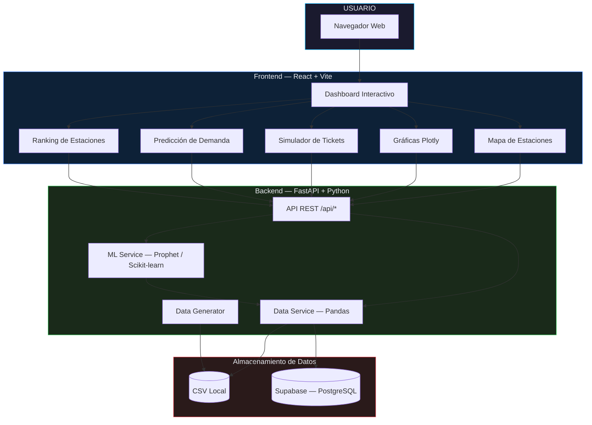

### Flujo de Registro de Tickets

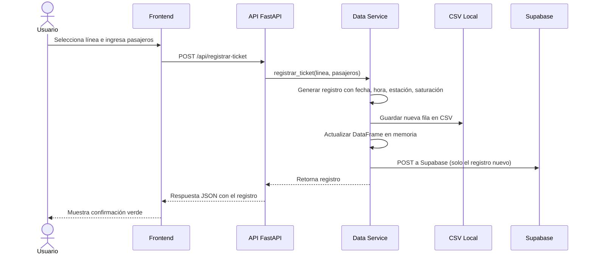

### Flujo de Predicción

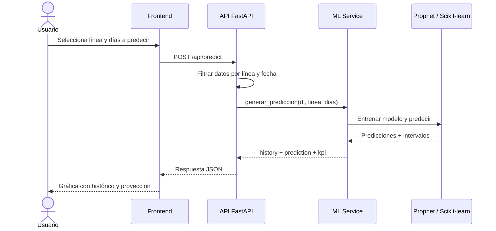

### Capas del sistema
#### Frontend (React + Vite)
- Interfaz gráfica del dashboard.
- Consume la API con Axios.
- Visualiza mapas, gráficos, ranking, tickets y predicciones.

#### Backend (FastAPI + Python)
- Expone los endpoints REST.
- Procesa datos con Pandas.
- Genera predicciones con Prophet y regresión lineal.
- Registra tickets nuevos en CSV y en Supabase.

#### Base de datos (Supabase)
- Almacena registros de pasajeros en PostgreSQL.
- Permite consultas SQL y acceso REST.

### Diagrama de Estructura de Carpetas

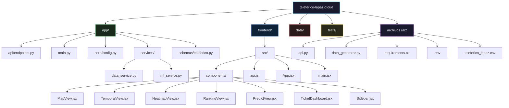

### Diagrama de Base de Datos (Schema)

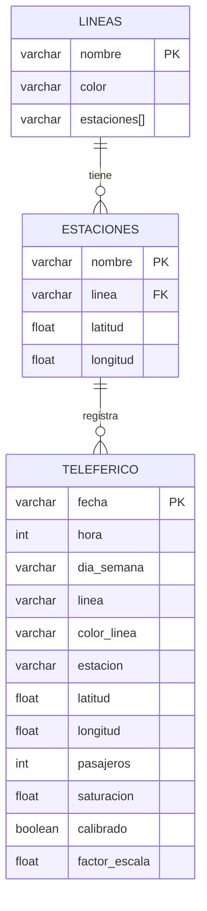

### Diagrama de Componentes del Frontend

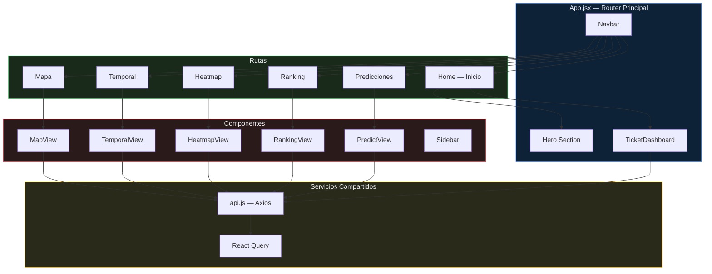

### Diagrama de Endpoints de la API

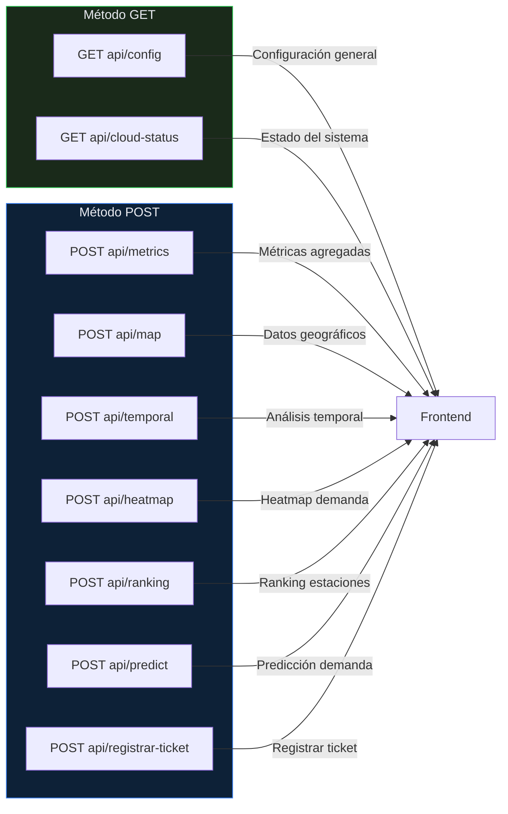

### Diagrama de Flujo de Datos del Heatmap

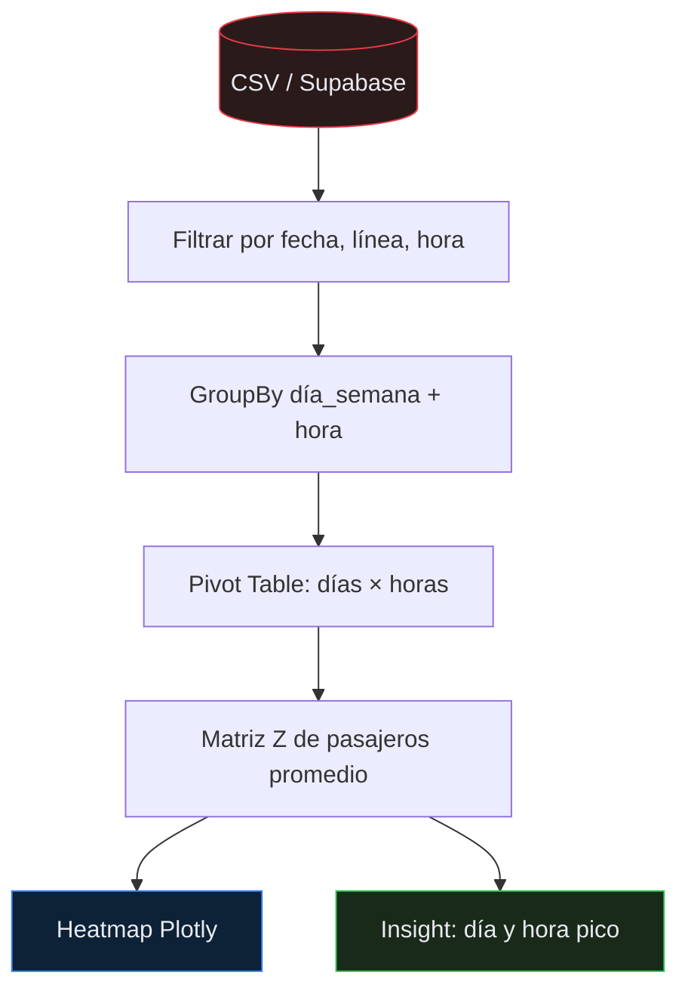

### Diagrama de Flujo del Ranking

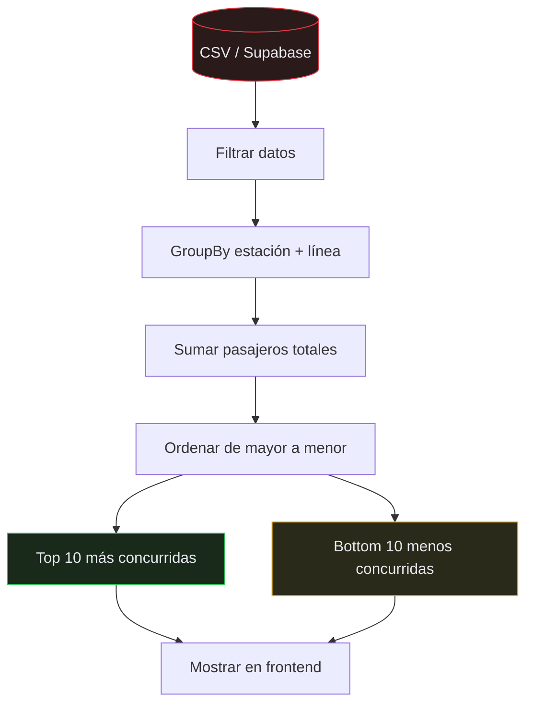

### Diagrama de Predicción con Prophet

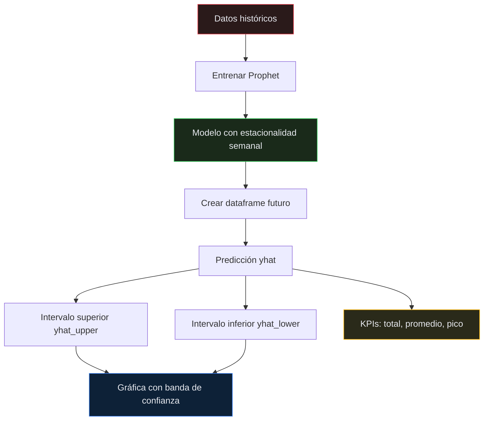

### Diagrama de Despliegue

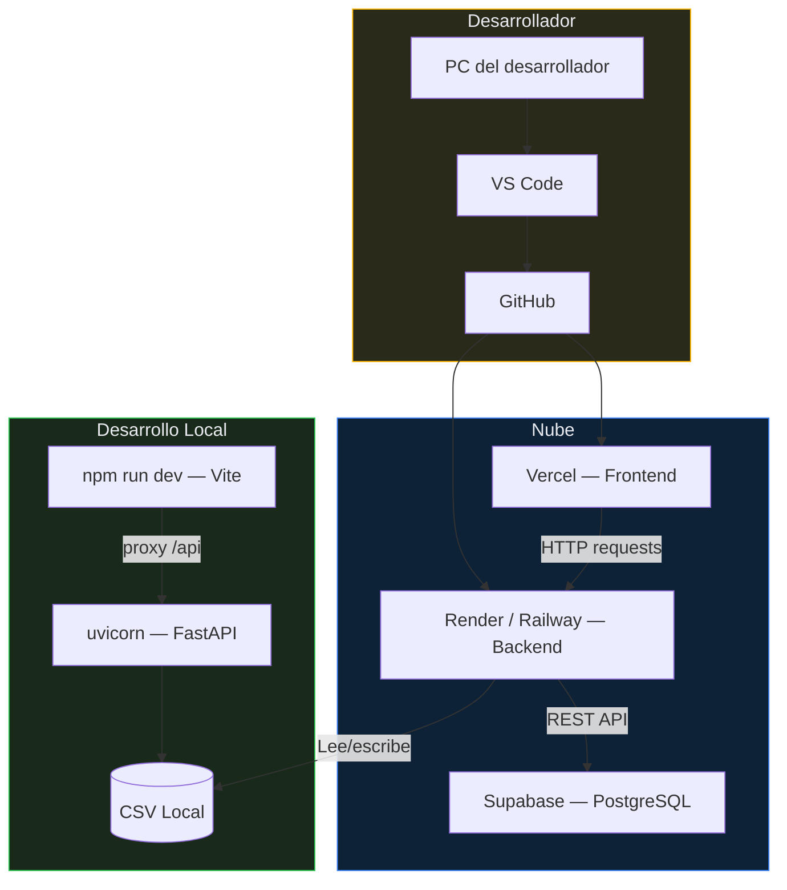

### Diagrama de Pipeline de Datos

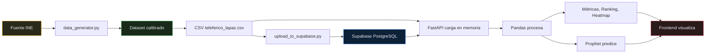

### Diagrama de Interacción del Usuario

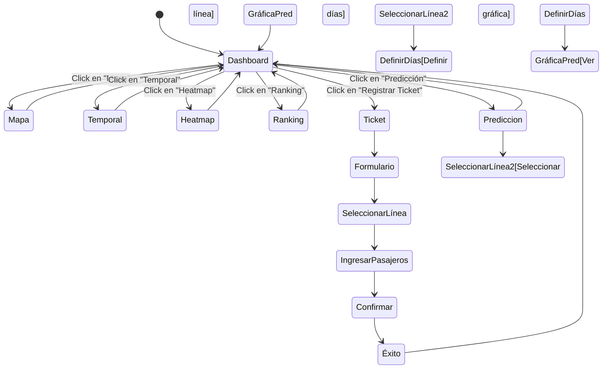

### Diagrama de Comparación: Datos Reales vs Simulados

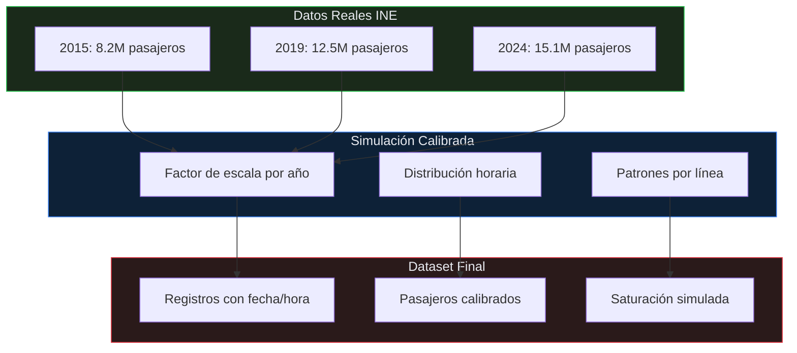

### Diagrama de Seguridad y Variables de Entorno

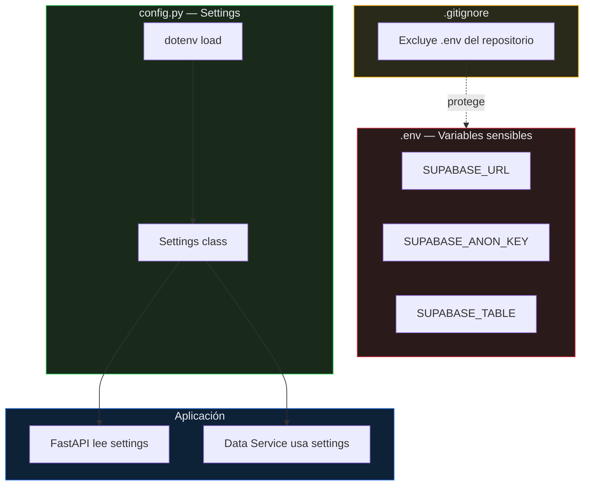

### Flujo de datos
1. El dataset se genera o carga en el backend.
2. El frontend solicita datos a la API.
3. El backend filtra, agrupa y devuelve métricas.
4. Las predicciones se calculan en el servidor.
5. Los tickets nuevos se guardan localmente y se suben a Supabase.

## IV. Análisis del Proyecto

### Problema que resuelve
- Necesidad de conocer el flujo de pasajeros en el Teleférico de La Paz.
- Falta de información para tomar decisiones sobre horarios, personal y capacidad.

### Solución propuesta
- Dashboard web para visualizar datos en tiempo real.
- Predicción de demanda futura.
- Ranking de estaciones más y menos concurridas.
- Simulador de tickets para probar el sistema con nuevos registros.

### Tipo de datos
- Datos de pasajeros por línea, estación, hora y día.
- Datos geográficos de estaciones.
- Datos de saturación y demanda.

### Modelos utilizados
- Prophet para predicción de series temporales con estacionalidad.
- Regresión lineal como respaldo si Prophet no está disponible.
- Métricas agregadas con Pandas para ranking, promedios y totales.

## V. Diseño del Sistema

### Diseño del backend
- Estructura en módulos: `api.py`, `app/services/`, `app/schemas/`, `app/core/`.
- Endpoints separados por función: métricas, mapa, temporal, heatmap, ranking, predicción y tickets.
- Validación de datos con Pydantic.
- Caché en memoria para mejorar tiempos de respuesta.

### Diseño del frontend
- Componentes por sección: mapa, temporal, heatmap, ranking, predicción, tickets.
- Navegación con React Router.
- Estado global con React Query para Actualización de datos.

### Diseño de datos
- CSV como fuente local principal.
- Supabase como base de datos en la nube.
- Conversión y limpieza de datos en el backend.

## VI. Tipo de Organización del Proyecto

### Organización técnica
- Código separado en carpetas: `app/`, `frontend/`, `data/`, `tests/`.
- Dependencias controladas con `requirements.txt` y `package.json`.
- Variables de entorno en `.env`.

### Organización del trabajo
- Despiegue separado para frontend y backend.
- Uso de GitHub para control de versiones.
- Documentación en README e informe.

## VII. Consulta para ver los datos más recientes en Supabase

### SQL (desde el Editor de Supabase)
```sql
SELECT *
FROM teleferico
ORDER BY fecha DESC, hora DESC
LIMIT 20;
```

### API REST
```http
GET https://<tu-proyecto>.supabase.co/rest/v1/teleferico?order=fecha.desc,hora.desc&limit=20
```

Headers necesarios:
```json
{
  "apikey": "<SUPABASE_ANON_KEY>",
  "Authorization": "Bearer <SUPABASE_ANON_KEY>"
}
```

### Nota
Con la implementación actual, cada ticket registrado desde el simulador se sube automáticamente a Supabase como un solo registro nuevo.
